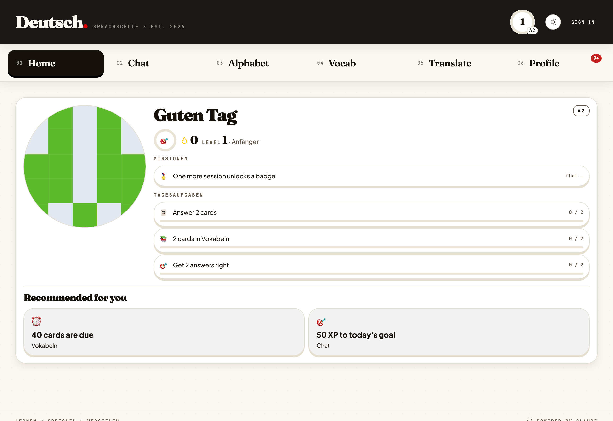
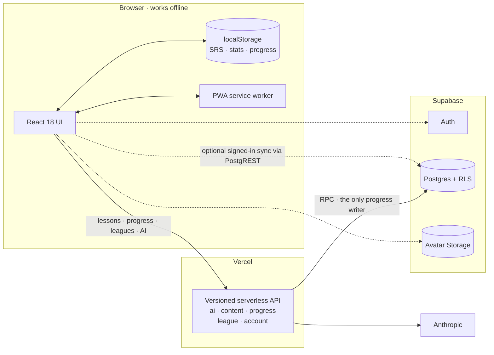

<div align="center">

<sup>SPRACHSCHULE · BUILT FOR CURIOUS MINDS</sup>

# Deutsch· — German practice with engineering depth

**An offline-first German-learning PWA that blends focused practice, deterministic
gamification, secure cross-device sync, and AI where it genuinely helps.**

[](https://deutsch-app-dusky.vercel.app)
[](https://github.com/blackhebrewisraeli/deutsch-app/actions/workflows/ci.yml)
[](https://react.dev/)
[](https://supabase.com/)
[](https://vercel.com/)
[](./LICENSE)

[Try the app](https://deutsch-app-dusky.vercel.app) ·
[Run it locally](#-quick-start) ·
[See the architecture](#-system-at-a-glance) ·
[Read the wiki](https://github.com/blackhebrewisraeli/deutsch-app/wiki)



<sub>Six surfaces, an offline CEFR placement test, and considerably more thought about merge semantics than a language app has any right to contain.</sub>

</div>

> [!NOTE]
> **Accounts are optional.** Placement, lessons, vocabulary, speech, SRS,
> progress, streaks, and quests all work locally. Signing in adds cross-device
> sync, leagues, and a portable profile; generative features require the server
> API.

## ✨ What learners get

| Experience                                  | What it does                                                                                |
| ------------------------------------------- | ------------------------------------------------------------------------------------------- |
| 🧭 **Offline placement**                    | Nine questions drawn from the course itself place you at A1, A2, or B1 — no account, no AI. |
| 💬 **Guided conversation**                  | An AI tutor sets level-aware scenarios, responds in character, and explains corrections.    |
| 🔤 **Alphabet & listening**                 | German speech synthesis, confusable-letter quizzes, and a browsable pronunciation grid.     |
| 🧠 **Vocabulary & SRS**                     | Practice, browse, and generate decks — preset, lexicon, grammar, and custom — on Leitner.   |
| ✍️ **Adaptive translation**                 | A1 word tiles, A2 fill-in-the-blank drills, and meaning-aware B1 grading.                   |
| 🎮 **Motivation that respects the learner** | XP, streak freezes, achievements, daily quests, and optional weekly leagues.                |

|                          Vocabulary practice                          |
| :-------------------------------------------------------------------: |
|  |

## 🦸 Two things that make it unusual

<details open>
<summary><strong>🔌 Offline-first sync that understands different kinds of data</strong></summary>

The browser's `localStorage` is the offline authority; Supabase is an optional
cross-device layer. Reconciliation happens client-side before PostgREST upserts,
so each state slice gets semantics that fit its data instead of one risky
"newest blob wins" rule.

| State slice                  | Merge strategy                                 | Why                                                                                      |
| ---------------------------- | ---------------------------------------------- | ---------------------------------------------------------------------------------------- |
| Daily stats                  | **Additive delta** from a synced baseline      | Repeated syncs stay idempotent without losing offline activity.                          |
| SRS cards                    | **Per-card LWW** on `lastReviewed`             | Reviewing one card should not overwrite another card's state.                            |
| Settings                     | **Whole-record LWW**, with explicit carve-outs | Ordinary preferences share a clock; special data does not.                               |
| CEFR level                   | **Independent LWW clock**                      | A newer unrelated setting cannot roll B1 back to A1.                                     |
| Learned words & deck mastery | **Union merge**                                | Learning on either device remains learned.                                               |
| Custom decks                 | **Per-deck LWW + tombstones**                  | Offline deletion competes with edits by timestamp instead of resurrecting removed decks. |

Deck deletion is the interesting edge case. An upsert-only system cannot express
absence, so a stale device would recreate a deleted deck. Deutsch· keeps a
timestamped tombstone; the same per-deck LWW comparison then decides whether an
edit or deletion is newer.

→ [Offline-First Sync Model](https://github.com/blackhebrewisraeli/deutsch-app/wiki/Offline-First-Sync-Model) in the wiki.

</details>

<details>
<summary><strong>🎯 Daily quests with deterministic variety and zero quest rows</strong></summary>

Three daily quests are derived—not stored—from a stable seed:

```js
seed = hash(`${userId ?? 'guest'}:${todayKey}`);
quests = pickQuestGroups(seed, 3);
progress = readExistingDailyCounters(todayKey);
```

The same learner gets the same quests all day, on every device, even offline.
There is no quest table to maintain, synchronize, or accidentally reshuffle.

Difficulty adapts without chasing outliers. Targets use the **median of the
previous seven days**, excluding today, then apply per-quest multipliers. A
single heroic study binge cannot make tomorrow miserable, and today's progress
cannot move today's goalposts.

Quests intentionally award achievements rather than XP. League XP stays tied to
actual graded practice, protecting the balance of a small, real learning loop.

</details>

## 🧭 System at a glance



> Learner-progress merges stay in pure client-side functions — deterministic,
> testable, and usable before the network returns. Server-side progress writes
> go through a single Postgres RPC, so the database has exactly one writer.

## ⚡ Quick start

**Prerequisites:** Node.js 22 (see `.nvmrc`) and npm.

```bash
git clone https://github.com/blackhebrewisraeli/deutsch-app.git
cd deutsch-app
npm install --legacy-peer-deps
npm run dev
```

Open [http://localhost:5173](http://localhost:5173). The offline-first learning
flows work with no Supabase, Vercel, or Anthropic credentials at all.

| Command            | Purpose                          |
| ------------------ | -------------------------------- |
| `npm run dev`      | Start the Vite UI                |
| `npm run dev:full` | Start Vite plus Vercel functions |
| `npm test`         | Run the main Vitest suite        |
| `npm run lint`     | Run ESLint                       |

Accounts, sync, leagues, avatars, and the AI endpoints each need a little more
setup — local Supabase via Docker, a few `VITE_*` flags, and an
`ANTHROPIC_API_KEY`. The full matrix, every npm script, and the usual
"why is sync doing nothing locally?" answer live in
**[Local Development](https://github.com/blackhebrewisraeli/deutsch-app/wiki/Local-Development)**.

## 📚 Where to learn more

Deep documentation lives in the **[project wiki](https://github.com/blackhebrewisraeli/deutsch-app/wiki)**.

| Page                                                                                                                  | What's there                                                    |
| --------------------------------------------------------------------------------------------------------------------- | --------------------------------------------------------------- |
| [Architecture Overview](https://github.com/blackhebrewisraeli/deutsch-app/wiki/Architecture-Overview)                 | The two-lane design, tech stack, and repository map             |
| [Offline-First Sync Model](https://github.com/blackhebrewisraeli/deutsch-app/wiki/Offline-First-Sync-Model)           | Merge semantics, tombstones, and independent LWW clocks         |
| [Lesson Engine](https://github.com/blackhebrewisraeli/deutsch-app/wiki/Lesson-Engine)                                 | Data-driven lessons, the exercise registry, and progress events |
| [Security & Role Architecture](https://github.com/blackhebrewisraeli/deutsch-app/wiki/Security-and-Role-Architecture) | Key boundaries, RLS, the AI boundary, and the avatar pipeline   |
| [Operations Runbooks](https://github.com/blackhebrewisraeli/deutsch-app/wiki/Operations-Runbooks)                     | OAuth, email templates, migrations, and the production drill    |
| [Local Development](https://github.com/blackhebrewisraeli/deutsch-app/wiki/Local-Development)                         | Full setup, every npm script, and troubleshooting               |
| [Contributing & Quality](https://github.com/blackhebrewisraeli/deutsch-app/wiki/Contributing-and-Quality)             | Testing philosophy, conventions, and the PR flow                |

Versioned material stays in the repository, where it is reviewed alongside the
code it describes: API contracts in [`docs/api/`](./docs/api/), and design specs
and implementation plans in [`docs/superpowers/`](./docs/superpowers/).

## 🤝 Contributing

Bug reports, accessibility findings, architecture questions, and focused pull
requests are all welcome. Please read [`AGENTS.md`](./AGENTS.md) first — it is
the single source of truth for this project's conventions and product
boundaries — and [Contributing & Quality](https://github.com/blackhebrewisraeli/deutsch-app/wiki/Contributing-and-Quality)
for the testing philosophy behind them.

## 📄 License

Released under the [MIT License](./LICENSE). Vocabulary sources and attribution
are documented separately in [`CONTENT_LICENSE.md`](./CONTENT_LICENSE.md).

<div align="center">

**Built to help people learn German—and to make the hard parts of frontend
engineering visible.**

[Launch Deutsch·](https://deutsch-app-dusky.vercel.app) ·
[Back to top](#deutsch--german-practice-with-engineering-depth)

</div>
