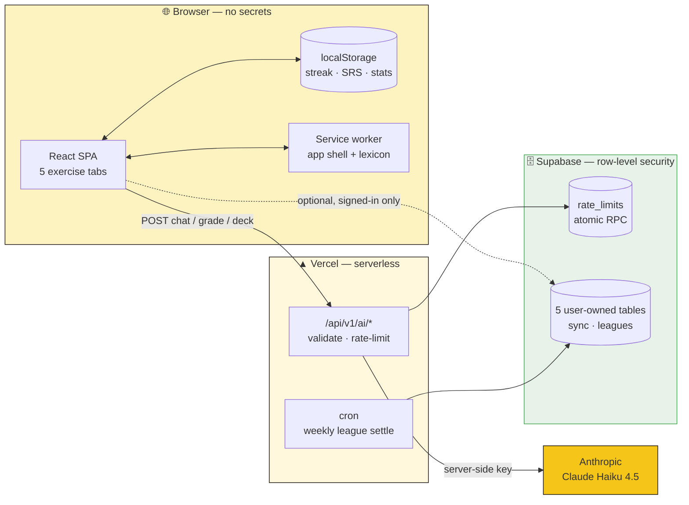

<div align="center">

<br/>

<sup>S P R A C H S C H U L E &nbsp;×&nbsp; E S T .&nbsp; 2 0 2 6</sup>

# Deutsch·

### _A guided German learning app — AI tutor, exercise-driven practice, installable PWA_

<p>
  <a href="https://deutsch-app-dusky.vercel.app"></a>
  &nbsp;
  <a href="https://github.com/blackhebrewisraeli/deutsch-app/actions/workflows/ci.yml"></a>
  &nbsp;
  
  &nbsp;
  
  &nbsp;
  
  &nbsp;
  
</p>

<p>
  
  &nbsp;
  
  &nbsp;
  
  &nbsp;
  
  &nbsp;
  
</p>

<p>
  <a href="#-quick-start"><b>▶ Run it locally</b></a> &nbsp;·&nbsp;
  <a href="#-features"><b>See the features</b></a> &nbsp;·&nbsp;
  <a href="#-how-it-works"><b>How it works</b></a>
</p>

<br/>

</div>

---

<table>
<tr><td width="33%" valign="top">

**Start here**

- [What is this?](#what-is-this)
- [At a glance](#at-a-glance)
- [⚡ Quick Start](#-quick-start)
- [📊 Learning Levels](#-learning-levels)

</td><td width="33%" valign="top">

**The app**

- [✦ Features](#-features) — all five tabs
- [🇩🇪 Grammar coverage](#-german-grammar--vocabulary-coverage)
- [📖 Importing vocabulary](#-importing-vocabulary)
- [🌐 Browser support](#-browser-support)

</td><td width="33%" valign="top">

**Under the hood**

- [⚙️ How it works](#-how-it-works)
- [🛠️ Tech stack](#-tech-stack)
- [🌍 Architecture](#-multi-language-architecture)
- [🚀 Deploy](#-deploy-to-production) · [📁 Structure](#-project-structure)

</td></tr>
</table>

> **Reading tip** — the long sections below are collapsed. Click any ▸ heading to open it.

---

## What is this?

**Deutsch · Sprachschule** is an exercise-driven German learning app that runs in the browser and installs as a PWA. It does not wait for you to know what to do — it gives you a task, you respond, and it tells you whether you got it right.

The app covers **three CEFR proficiency levels** (A1 · A2 · B1) across four exercise modules — guided conversation, alphabet recognition, vocabulary active recall, and translation — plus a **Stats tab** that records every interaction and resurfaces what you got wrong. Vocab draws on a **4,480-word German lexicon** — each entry with gender, plural, IPA, example sentences, and verb conjugation — scheduled by a **Leitner spaced-repetition** algorithm, so cards return at the right time, not on every visit.

All AI features call **Claude Haiku 4.5** through a versioned server-side API (`/api/v1/ai/*` — validated, rate-limited, [contract-documented](./docs/api/ai.md)) — your API key never touches the browser.

**Accounts are optional.** Everything works anonymously and offline; signing in adds cross-device sync and weekly leagues, nothing more.

---

## At a glance

|                      |                                                                                                                        |
| -------------------- | ---------------------------------------------------------------------------------------------------------------------- |
| **Live**             | [deutsch-app-dusky.vercel.app](https://deutsch-app-dusky.vercel.app) — installable PWA, works offline after first load |
| **Exercise modules** | 5 — Chat · Alphabet · Vocab · Translate · Stats                                                                        |
| **Levels**           | A1 · A2 · B1, each with its own exercise mode                                                                          |
| **Vocabulary**       | 4,480 words · 13 generated decks + 4 hand-written starter decks                                                        |
| **Scheduling**       | Leitner spaced repetition, 5 boxes (1d → 30d)                                                                          |
| **Social**           | Weekly XP leagues, ~25-person cohorts, promotion / relegation                                                          |
| **AI**               | Claude Haiku 4.5 behind `/api/v1/ai/*` — key stays server-side                                                         |
| **Data**             | Local-first (`localStorage`), optional Supabase sync under row-level security                                          |
| **Quality gates**    | 773 tests · 38 adversarial RLS tests · lint + format + full suite on every commit                                      |

---

## 📊 Learning Levels

Choose your level on the splash screen. It is stored in `localStorage` and drives the exercise mode in every tab.

|         Level         | CEFR description                                               | Exercise mode                                                                             |
| :-------------------: | -------------------------------------------------------------- | ----------------------------------------------------------------------------------------- |
|   **A1 — Beginner**   | You know basic vocabulary and can form simple sentences        | **Word tiles** — all German words provided; assemble them in the correct order            |
|  **A2 — Elementary**  | You can handle familiar situations with some grammar knowledge | **Fill the blanks** — sentence shown with 2–3 key words missing; select from a tile bank  |
| **B1 — Intermediate** | You can describe experiences and explain opinions in German    | **Free typing + AI grading** — translate the sentence yourself; Claude grades your answer |

You can change your level at any time by clearing the onboarding state (or via returning to the splash screen on first visit to a new device).

---

## ✦ Features

<details>
<summary><b>01 · Chat</b> — Guided conversation with an AI tutor that sets you a task</summary>
<br/>

Anna, your AI tutor, does not wait for you to speak. She opens each session with a **task suited to your level** and guides you toward completing it.

**How tasks work:**

```
╔══════════════════════════════════╗
║  C  YOUR TASK                    ║
║  ─────────────────────────────── ║
║  TASK 1                          ║
║  "Order a large coffee and ask   ║
║   how much it costs."            ║
║                                  ║
║  [SHOW HINT]                     ║
╚══════════════════════════════════╝
```

Hints are available (always visible for A1, toggle for A2, hidden for B1). When Claude detects the task is naturally complete, the panel advances to the next task automatically.

**Four scenarios, three difficulty levels each:**

| Scenario         | A1 example task                            | B1 example task                                                      |
| ---------------- | ------------------------------------------ | -------------------------------------------------------------------- |
| ◆ Free Chat      | "Say hello and tell Anna your name."       | "Tell Anna about a problem you had recently and how you solved it."  |
| ☕ Order Coffee  | "Order a coffee."                          | "Complain politely that your order is wrong."                        |
| ✶ Meet Someone   | "Ask Anna her name and where she is from." | "Have a natural small-talk conversation about your week."            |
| ✈ At the Airport | "Ask where the check-in desk is."          | "Explain that your flight was cancelled and ask about your options." |

**Inline grammar correction:**

Every reply is evaluated. If you make a mistake, the correction panel shows:

```
⚠  NEEDS A FIX
──────────────────────────────────────────────────
YOU SAID   →   Ich lerne Deutsch seit drei Monat.
CORRECT    →   Ich lerne Deutsch seit drei Monaten.   [ HEAR IT ]

"After 'seit' (since), use the dative case.
'Monat' → 'Monaten' (plural dative)."
──────────────────────────────────────────────────
```

**Anna's JSON response schema (what Claude returns on every turn):**

```json
{
  "de": "Willkommen! Was darf ich Ihnen bringen?",
  "ipa": "[vɪlˈkɔmən vas daʁf ɪç ˈiːnən ˈbʁɪŋən]",
  "en": "Welcome! What can I bring you?",
  "correction": null,
  "taskComplete": false
}
```

When `taskComplete` is `true`, the task panel advances to the next task for the current scenario.

</details>

---

<details>
<summary><b>02 · Alphabet</b> — Hear a letter, pick it out of four confusable neighbours</summary>
<br/>

Two modes behind a toggle:

**Quiz mode (default):** A letter is spoken aloud by the browser's German TTS voice. Four confusable letter options are shown — tap the one you heard. Score tracked per session.

```
ROUND 4 · SCORE 3/3 · WHICH LETTER DID YOU HEAR?

        🔊   TAP TO HEAR AGAIN

    ┌──────┐  ┌──────┐
    │  U   │  │  Ü   │ ← correct
    ├──────┤  ├──────┤
    │  O   │  │  Ö   │
    └──────┘  └──────┘
```

**Letter groups are chosen for maximum confusion value** — letters that German learners commonly mishear:

| Group | Letters       | Why confusable                |
| :---: | ------------- | ----------------------------- |
|   1   | U · Ü · O · Ö | Front/back vowel pairs        |
|   2   | A · Ä · E · I | Short vowel spectrum          |
|   3   | S · ß · Z · W | Sibilants and voiced variants |
|   4   | B · P · D · T | Voiced/unvoiced pairs         |
|   5   | V · W · F · B | Labial consonants             |
|   6   | G · K · J · Y | Velar and palatal consonants  |
|   7   | R · L · N · M | Liquids and nasals            |
|   8   | H · X · Q · C | Rare / silent letters         |

**Browse mode:** The full 30-letter grid (A–Z + Ä · Ö · Ü · ß). Click any letter to hear it spoken, see an example word, and read its English meaning.

</details>

---

<details>
<summary><b>03 · Vocab</b> — Active recall over a 4,480-word lexicon, scheduled by SRS</summary>
<br/>

Cards never just flip to reveal the answer — you have to produce it first.

**A1 / A2 — Multiple choice (4 options):**

```
CARD 4 / 10 · WHAT DOES THIS MEAN?

┌────────────────────────────────────┐
│                                    │
│         der Hund                   │
│     [deːɐ̯ hʊnt]                   │
│                                    │
└────────────────────────────────────┘

  ┌──────────┐   ┌──────────┐
  │   cat    │   │   dog ✓  │  ← gold flash
  ├──────────┤   ├──────────┤
  │   horse  │   │   bird   │
  └──────────┘   └──────────┘
```

**B1 — Type the meaning:**

```
CARD 4 / 10 · TRANSLATE THIS WORD

┌────────────────────────────────────┐
│           der Hund                 │
└────────────────────────────────────┘

  [ dog                           ]  ← text input
  [ CHECK → ]
```

Answers within **Levenshtein distance ≤ 2** (one or two typos) are marked **ALMOST** and advance the card. Wrong answers return to the back of the queue — the deck never completes until every card is answered correctly at least once.

**Starter decks** — four hand-written decks of 10 cards, always available offline:

| Deck         | Sample words                                   |
| ------------ | ---------------------------------------------- |
| Greetings    | Hallo, Guten Morgen, Tschüss, Wie geht es dir? |
| Food & Drink | das Brot, der Kaffee, die Milch, der Apfel     |
| Travel       | der Bahnhof, der Pass, links, geradeaus        |
| Numbers      | eins through zehn                              |

**The lexicon — 4,480 words.** Beyond the starter decks the app ships a full German
lexicon, imported from open datasets and lazy-loaded in chunks (cached for offline
use after first visit). Every entry carries far more than a translation:

| Field                 | Example (`das Haus`)                                    |
| --------------------- | ------------------------------------------------------- |
| Article / gender      | `das`                                                   |
| Plural                | `Häuser`                                                |
| IPA                   | `[haʊ̯s]`                                                |
| Example sentence      | _Auf dem Hügel steht ein Haus._                         |
| Verb conjugation      | present tense, Partizip II, `haben`/`sein` (verbs only) |
| Frequency rank + CEFR | rank 456 · A1                                           |

Those entries are sliced into **13 decks** you can jump between:

| Group         | Decks                                                                                 |
| ------------- | ------------------------------------------------------------------------------------- |
| **Frequency** | Core 100, Top 500 — the most common words first                                       |
| **CEFR**      | A1 (896) · A2 (1,344) · B1 (2,240) — banded by position in the lexicon                |
| **Topics**    | Lifestyle, Science, Hobbies & Games, Sports, Politics, Business & Law, Tech, Medicine |

Word data comes from Wiktionary (via Wiktextract), example sentences from Tatoeba,
and frequency ranking from the Leipzig Corpora Collection — see
[Importing vocabulary](#-importing-vocabulary) for the one-command import and
[CONTENT_LICENSE.md](./CONTENT_LICENSE.md) for attribution.

**AI-generated decks:** Type any topic — _colours, animals, at the doctor's, football_ — and Claude generates a 10-card deck with German articles for nouns, IPA, and English meanings.

</details>

---

<details>
<summary><b>04 · Translate</b> — Translate a sentence — tiles, blanks, or free typing by level</summary>
<br/>

The app gives you a sentence. You translate it. The exercise mode depends on your level.

**A1 — Word tiles:**

```
TRANSLATE TO GERMAN
"I drink water."

YOUR ANSWER ─────────────────────────────────
  [ Ich ] [ trinke ]  ← placed tiles (click to return)

WORD BANK ───────────────────────────────────
  [ Wasser. ]  [ esse ]  [ laufe ]

[ CHECK → ]  [ ⏭ skip ]
```

**A2 — Fill the blanks:**

```
TRANSLATE TO GERMAN
"The child plays with the ball."

COMPLETE THE SENTENCE
  Das Kind spielt mit ___ Ball.

  [ der ]  [ den ]  [dem] ← correct  [ die ]

[ CHECK → ]  [ ⏭ skip ]
```

**B1 — Free typing + AI grading:**

```
TRANSLATE TO GERMAN
"Despite the rain, we enjoyed the walk."

  ┌────────────────────────────────────────┐
  │ Trotz des Regens haben wir den        │
  │ Spaziergang genossen.                  │
  └────────────────────────────────────────┘

[ CHECK →  ]  [ ⏭ skip ]

✓ CORRECT ───────────────────────────────────
  "Great use of 'trotz + genitive' and
   Perfekt with haben."
[ NEXT EXERCISE → ]
```

**B1 grading prompt schema (what Claude returns):**

```json
{
  "verdict": "correct",
  "corrected": "Trotz des Regens haben wir den Spaziergang genossen.",
  "message": "Perfect. Note: 'trotz' always takes genitive — des Regens, not dem Regen."
}
```

`verdict` is `"correct"`, `"almost"`, or `"wrong"`. Both **correct** and **almost** advance the exercise.

When the **built-in sentence bank** (10 sentences per level) is exhausted, Claude generates 5 fresh sentences on demand and appends them — the exercise never runs out.

</details>

---

### Progress tracking

The header shows **level**, **streak**, and **daily goal** progress (XP-derived), persisted in `localStorage`:

- **Level badge** — XP from all graded exercises; rank names (Anfänger → Fließend, …)
- 🔥 **Streak** — consecutive days with at least one visit
- **Goal ring** — today's XP vs. daily target (configurable in Stats)

The **05 Stats** tab shows total XP, learned-word count, achievements, and goal/sound settings. A red badge on the Stats nav tab shows how many items are waiting for review (wrong answers + due vocab cards), capped at "9+". Six practice dashboards — see the next section.

---

<details>
<summary><b>05 · Stats</b> — Six dashboards over every graded interaction</summary>
<br/>

A dedicated tab that records every graded interaction across the four exercise modules and turns them into an at-a-glance picture of practice.

```
╔══════════════════════════════════════════════════════════════════╗
║  TODAY                                                            ║
║  12  exercises    ACCURACY · STREAK 4                             ║
║                  [████████░░░░██░░] ✓ 8 (67%) ≈ 2 (17%) ✗ 2 (16%) ║
╚══════════════════════════════════════════════════════════════════╝
```

**Six sections (A–F):**

| #   | Section                        | Shows                                                                                                                      |
| --- | ------------------------------ | -------------------------------------------------------------------------------------------------------------------------- |
| A   | **Today**                      | Today's total exercises, three-way accuracy bar (correct / almost / wrong), streak count                                   |
| B   | **Last 12 months**             | GitHub-style heatmap of daily activity (53 weeks × 7 days, 5 intensity buckets)                                            |
| C   | **By section**                 | Horizontal bars: Chat / Alphabet / Vocab / Translate. Most-practised tab is highlighted red.                               |
| D   | **Accuracy by level**          | Three-way stacked bars per CEFR level (A1 / A2 / B1)                                                                       |
| E   | **Review — tap to re-attempt** | Up to 10 most-recently-wrong items. Click a row → jump straight to that exercise with the item pre-loaded.                 |
| F   | **Vocab review queue**         | DUE NOW count + mastered progress bar (out of 40 cards) + per-deck breakdown (Greetings / Food & Drink / Travel / Numbers) |

**Storage:** all event data is forward-only — past practice is not backfilled. Schema extends `deutsch-app-state-v1`:

```js
{
  stats:        { streak, learnedCount, lastVisit },
  learnedWords: { '<de>': bool },
  daily:        { 'YYYY-MM-DD': { total, byTab, byLevel: { a1, a2, b1: { correct, almost, wrong } } } },
  items:        { '<tab>:<context>:<label>': { tab, context, label, detail, lastVerdict, lastTs, attempts, wrongCount } },
  srs:          { '<deckId>:<id>': { box, lastReviewed, nextDue, reps } },
  gamification: { goal, soundOn, achievements, lastGoalMet },
}
```

**Spaced repetition (Leitner):** Vocab cards live in 5 boxes with intervals 1d / 3d / 7d / 14d / 30d. After each card you pick **Hard / Good / Easy** (or **Again** on a wrong answer) and the system schedules the next review accordingly. Box 5 = mastered. The Vocab queue is ordered _due first → new → over-review_, so you always start with what needs you most.

</details>

---

<details>
<summary><b>06 · Leagues</b> — optional weekly XP competition, for signed-in learners</summary>
<br/>

Signing in unlocks a weekly league on the Stats tab. It is entirely optional — everything else in the app works anonymously.

```
LIGA · WOCHE 31                          ends in 2d 4h
──────────────────────────────────────────────────────
  ▲ PROMOTION ZONE
  1  anna_b          1,240 XP
  2  you               980 XP   ← highlighted
  3  markus            910 XP
  ─────────────────────────────
  …
  ▼ RELEGATION ZONE
```

|              |                                                                                 |
| ------------ | ------------------------------------------------------------------------------- |
| **Cohort**   | ~25 learners, assigned on join                                                  |
| **Scoring**  | XP earned during the week, from the same graded exercises that drive your level |
| **Movement** | Top of the table promotes, bottom relegates, settled by a scheduled cron        |
| **Reward**   | A _Liga-Meister_ badge for finishing first                                      |

Leagues run on the Supabase lane under the same row-level security as sync: you can read your cohort's standings and write only your own row. The weekly settle runs server-side behind `CRON_SECRET`.

</details>

---

## 🇩🇪 German Grammar & Vocabulary Coverage

<details>
<summary><b>Open</b> — what the exercise bank actually drills, level by level</summary>
<br/>

### Grammar topics by level

**A1 — Word order and basic conjugation**

- Subject–Verb–Object sentence structure
- Present tense conjugation: `ich bin / habe / gehe / trinke / lese`
- Nominative articles: `der / die / das` + gender recognition
- Basic negation and simple adjective agreement

**A2 — Cases, prepositions, and adjective endings**
| Grammar point | Example from exercise bank |
|---|---|
| Accusative masculine | _einen großen Hund_ (ein → einen; groß → großen) |
| Movement vs. location | _in die Schule_ (acc.) vs. _in der Schule_ (dat.) |
| Dative after prepositions | _mit dem Ball, zu meinem Freund_ |
| Contractions | _ins = in + das, im = in + dem, zum = zu + dem_ |
| Possessives in dative | _ihrem Freund_ (dative masculine) |
| Adjective endings after definite article | _Das rote Auto_ (neuter nom. → -e) |

**B1 — Complex structures and mood**
| Grammar point | Example from exercise bank |
|---|---|
| Perfekt with _sein_ | _bin … gegangen_ (movement verb) |
| Perfekt with _haben_ | _habe … gekauft, genossen_ |
| Konjunktiv II | _hätte, würde + infinitive_ |
| seit + present tense | _Er wohnt seit drei Jahren …_ |
| Modal verbs | _Ich muss … fertigstellen_ (verb-final) |
| Relative clauses | _Die Frau, deren Tasche …_ (genitive _deren_) |
| trotz + genitive | _Trotz des Regens …_ |
| Indirect speech | _dass … kommen würde_ (verb-final) |
| Conditional perfect | _hätte … angerufen, wenn … gewusst hätte_ |
| Indirect questions | _Könnten Sie sagen, wo … ist?_ |

### Vocabulary domains

The built-in content covers these semantic fields across all levels:

- **Greetings & social phrases** — Hallo, Auf Wiedersehen, Wie geht es dir?
- **Food & drink** — das Brot, der Kaffee, die Milch, das Bier
- **Travel & transport** — der Bahnhof, der Flughafen, links, geradeaus
- **Numbers** — eins through zehn
- **Daily objects** — das Haus, die Katze, der Hund, das Buch
- **Body & feelings** — ich bin müde / hungrig
- **Time expressions** — jeden Tag, seit, gestern

AI-generated decks expand to any domain on demand.

</details>

---

## 📈 Project Status

Everything described above is live at [deutsch-app-dusky.vercel.app](https://deutsch-app-dusky.vercel.app).

| Area                          | State                                                                                                                |
| ----------------------------- | -------------------------------------------------------------------------------------------------------------------- |
| **Five exercise modules**     | ✅ shipped                                                                                                           |
| **4,480-word lexicon**        | ✅ shipped — one-command, byte-reproducible import                                                                   |
| **Spaced repetition + stats** | ✅ shipped                                                                                                           |
| **Accounts, sync, leagues**   | ✅ live in production, all optional                                                                                  |
| **Error monitoring**          | ✅ Sentry, errors-only, EU region                                                                                    |
| **PWA**                       | ✅ installable; offline reload verified on-device                                                                    |
| **Second language pack**      | ⬜ the engine is language-blind and German is the reference pack — see [Architecture](#-multi-language-architecture) |

<details>
<summary><b>Recent hardening</b> — what the last pass fixed</summary>
<br/>

A pre-demo readiness pass ([`docs/DEMO_READINESS.md`](./docs/DEMO_READINESS.md)) worked through every visible defect:

| Fix                         | Detail                                                                                                                                                                       |
| --------------------------- | ---------------------------------------------------------------------------------------------------------------------------------------------------------------------------- |
| **Deck progress indicator** | Rendered one DOM node per card — at 2,240 cards it pushed the page 54× wider than the viewport. Now a bounded bar above 12 cards.                                            |
| **Mobile layout**           | Five separate overflows at 375px, four of them a bare `1fr` grid track refusing to shrink below its content. Every `gridTemplateColumns` now uses `minmax(0, …)`.            |
| **Flashcard answers**       | Raw Wiktionary glosses ("ARCHAIC FORM OF STANDEN, FIRST/THIRD-PERSON PLURAL PRETERITE OF STEHEN") are cleaned at import; `alt-of` records no longer ship as their own cards. |
| **Entry-id stability**      | Entry ids key saved progress, so the import derives them from the _raw_ gloss — cleaning display text never silently resets a learner's SRS state.                           |

Known and deliberately open: the same German word can still appear on more than one card when senses genuinely differ (`in` as preposition _and_ adjective).

</details>

---

## 🛠️ Tech Stack

| Layer              | Technology                                                  | Purpose                                                                                                                                                                                                                                                                                                                                                                      |
| ------------------ | ----------------------------------------------------------- | ---------------------------------------------------------------------------------------------------------------------------------------------------------------------------------------------------------------------------------------------------------------------------------------------------------------------------------------------------------------------------- |
| Framework          | **React 18**                                                | Component model, hooks, concurrent state                                                                                                                                                                                                                                                                                                                                     |
| Build tool         | **Vite 5**                                                  | Dev server, fast HMR, PWA build (`npm run dev:full` adds the API via vercel dev)                                                                                                                                                                                                                                                                                             |
| AI                 | **Claude Haiku 4.5** (`claude-haiku-4-5-20251001`)          | Tutor, grading, deck generation, translation                                                                                                                                                                                                                                                                                                                                 |
| Speech synthesis   | **SpeechSynthesis API**                                     | Native German TTS — no external service                                                                                                                                                                                                                                                                                                                                      |
| Speech recognition | **Web Speech API**                                          | Microphone input in Chat — Chrome/Edge only                                                                                                                                                                                                                                                                                                                                  |
| Icons              | **lucide-react**                                            | Consistent SVG icon set                                                                                                                                                                                                                                                                                                                                                      |
| Typography         | **Fraunces** (display) + **JetBrains Mono** (labels)        | Editorial serif + technical mono                                                                                                                                                                                                                                                                                                                                             |
| Design tokens      | `src/lib/theme.js`                                          | Centralised colours, type scale, spacing, component composites                                                                                                                                                                                                                                                                                                               |
| Persistence        | **localStorage** (local-first)                              | Streak, learned words, SRS + stats, gamification — kept in `deutsch-app-state-v1`                                                                                                                                                                                                                                                                                            |
| Sync               | **localStorage ↔ Supabase** engine                          | Built + merged (B2.2): folds local state into per-user rows via LWW / additive-delta / union merges, behind the `VITE_SYNC_ENABLED` build flag — **live in production**                                                                                                                                                                                                      |
| Auth               | **Supabase Auth** (magic-link + OTP)                        | Passwordless, anonymous-first sign-in UI; gates the sync engine                                                                                                                                                                                                                                                                                                              |
| Backend data       | **Supabase** (Postgres + RLS)                               | Live: durable per-IP rate quotas via an atomic RPC; five user-owned tables under adversarially-tested row-level security (revoked-by-default Data API grants) backing the sync engine                                                                                                                                                                                        |
| Error monitoring   | **Sentry** (errors-only)                                    | Live in prod + Preview (EU region) — runtime error capture, no PII or session replay                                                                                                                                                                                                                                                                                         |
| Linting            | **ESLint 10** (flat config) + `react-hooks/exhaustive-deps` | Catches stale closures, missing deps, unused vars                                                                                                                                                                                                                                                                                                                            |
| Formatting         | **Prettier 3**                                              | Consistent code style, enforced on every commit                                                                                                                                                                                                                                                                                                                              |
| Testing            | **Vitest 2** + **jsdom** + **React Testing Library**        | **773 tests** — engine (`src/lib/*`) incl. the sync-engine merges, packs, content invariants, the API middleware and per-route quota contracts (`api/`), the dev-toolkit graph helpers (`scripts/`), and component tests across every tab — plus a separate **38-test adversarial RLS suite** (`npm run test:rls`) that attacks the database policies through real PostgREST |
| CI                 | **GitHub Actions**                                          | Runs lint + test + build on every push to `main` and every PR                                                                                                                                                                                                                                                                                                                |
| Pre-commit         | **Husky + lint-staged**                                     | Runs ESLint + Prettier + the full test suite before every `git commit`                                                                                                                                                                                                                                                                                                       |
| PWA                | **vite-plugin-pwa** + Workbox                               | Installable on iOS/Android, offline-capable static assets                                                                                                                                                                                                                                                                                                                    |
| Responsive         | `useWindowWidth` hook                                       | Live viewport width → inline style breakpoints (mobile < 640px)                                                                                                                                                                                                                                                                                                              |
| Accessibility      | Semantic HTML + ARIA                                        | Labeled icon controls, keyboard-operable widgets, visible focus states                                                                                                                                                                                                                                                                                                       |
| Deployment         | **Vercel**                                                  | Static SPA + versioned `/api/v1/*` serverless functions (+ legacy `/api/chat` alias)                                                                                                                                                                                                                                                                                         |

**No CSS framework. Accounts are optional — anonymous-first by design.** The browser's only external call is to the app's own API. Server-side, the backend has two lanes: the **AI service** (`/api/v1/ai/*` → Anthropic) and the **Supabase data lane** (live) carrying durable rate limiting plus the schema + row-level security behind the localStorage↔Supabase **sync engine** (live in production) — see the [backend architecture spec](./docs/superpowers/specs/2026-06-10-backend-architecture-design.md) and the [B1 design](./docs/superpowers/specs/2026-06-12-backend-b1-data-lane-design.md).

---

## ⚙️ How It Works

### The shape of the system



The browser holds no secrets and needs no account. Local-first storage means the app is fully usable offline; the Supabase lane is additive — it carries durable rate limiting (always) and, for signed-in learners only, sync and leagues.

### The API proxy — keeping your key safe

Every environment calls the same versioned serverless endpoints — `/api/v1/ai/chat`, `/api/v1/ai/grade`, `/api/v1/ai/deck` ([contract docs](./docs/api/ai.md)):

```
Browser                Vercel function (/api/v1/ai/*)        Anthropic API
   │                            │                                  │
   │  POST /api/v1/ai/chat      │                                  │
   │  ─────────────────────────►│  validate · rate-limit · rebuild │
   │                            │  x-api-key: [ANTHROPIC_API_KEY]  │
   │                            │  ────────────────────────────── ►│
   │                            │◄─────────────────────────────────│
   │◄───────────────────────────│                                  │
```

In production the functions read `ANTHROPIC_API_KEY` from Vercel's environment. Locally, `npm run dev:full` (vercel dev) runs the **same functions** with the Development environment injected — the key never appears in the browser bundle, in any environment. Endpoints reject bodies that fail validation ([error envelope](./docs/api/README.md)) and are rate-limited per IP with **per-route quotas** (chat 20/5 min · deck 5/hour · grade 60/5 min). Quota counters live **durably in Supabase** via an atomic `increment_rate_limit` RPC — surviving cold starts and shared across function instances — with a per-instance in-memory fallback when `SUPABASE_*` is unset. Malformed requests still consume quota: garbage is not free.

### Exercise content flow

```
Component mounts
      │
      ▼
shuffle(BANK_MAP[level])        ← built-in sentences from content.js
      │
      ▼
User works through exercises    ← 10 per set
      │
   exhausted?
      │ yes
      ▼
generateMoreSentences(level)    ← Claude generates 5 more, appended
      │
      ▼
Continue                        ← new exercises appended, score resets
```

### How each Claude call is structured

**Chat (Anna)** — returns structured JSON with conversation awareness:

```
System: You are Anna, a German tutor. Current scenario: [café].
        Task: "Order a large coffee and ask the price."
        Level: A2 — use natural but simple German.
        Respond ONLY with JSON: { de, ipa, en, correction, taskComplete }

User history: [previous turns passed as messages array]
User: "Ich möchte ein Kaffee groß, bitte."
```

**B1 Translation grading** — single-shot evaluation:

```
System: You are a German grader. Respond ONLY with JSON: { verdict, corrected, message }
        verdict: "correct" | "almost" | "wrong"

User: English: "…" | Ideal German: "…" | Learner's answer: "…"
```

**Vocabulary generation** — single-shot JSON array:

```
System: Generate German flashcards. Respond ONLY with a JSON array, no markdown.

User: Generate 10 cards on topic: "animals".
      Return: [{ de, en, ipa }]
```

**A2 sentence generation** (when bank exhausted):

```
System: Generate A2 fill-in-the-blank exercises.

User: Return: [{ en, de, template, blanks: [{ word, distractors }], note }]
```

All JSON responses strip markdown fences (` ```json ... ``` `) before `JSON.parse()` as a defensive measure.

---

## 🌍 Multi-Language Architecture

Deutsch is being evolved from a single-language app into a **language-agnostic learning platform**: the engine — spaced repetition, exercises, answer-matching, progress, gamification — knows nothing about any specific language, and each language is a **content pack** that plugs into one interface. German is the reference "finished product" that proves the engine end-to-end.

**Three swappable layers:**

| Layer            | What it is                                                                                                      | Where                                        |
| ---------------- | --------------------------------------------------------------------------------------------------------------- | -------------------------------------------- |
| **Engine**       | SRS, stats, gamification, answer-matching — language-blind                                                      | `src/lib/*`                                  |
| **Content pack** | Per language: vocabulary, scenarios, exercises, validation rules, prompts — behind the `LanguagePack` interface | `src/packs/de/`                              |
| **Theme**        | Design tokens (colours, fonts) per language/brand                                                               | `src/lib/theme.js` (per-pack tokens planned) |

The active pack is a module singleton (`activePack`); the engine matches answers through a pack-supplied `normalize` rather than hardcoding German rules. Adding a language means dropping in a new pack — no engine rewrite.

**Phased roadmap** — German stays fully working at every step:

- ✅ **Phase 0** — the `LanguagePack` interface; German content loads through it _(merged)_
- 🚧 **Phase 1** — ✅ language-neutral card identity _(merged — SRS/stats key on `card.id`)_ · ✅ all translate exercises grade through pack-supplied `normalize` _(merged)_ · ✅ TTS voice/locale picked from the pack, not hardcoded `de-DE` _(merged)_; next: diacritic-aware validation, grammar + AI prompts moved into the pack, content relocated under `src/packs/de/`
- ⬜ **Phase 2** extract theme tokens · **Phase 3** add a second pack (e.g. Spanish) to prove the abstraction · **Phase 4** language picker + per-language progress

**Backend arc (parallel track):** the **user interface** (this PWA) and the **developer interface** (versioned REST surface + database contract) are being separated into a two-lane backend. Lane 1 — the AI service (`/api/v1/ai/*`: validation, per-IP quotas, error envelope) — is **live**. Lane 2 — Supabase — is **live**: durable rate limiting runs on it in production, and the sync schema (five user-owned tables under adversarially-tested row-level security, with explicit revoked-by-default Data API grants — `anon` can touch nothing) is deployed. The **localStorage↔Supabase sync engine + magic-link auth are live in production**, as are **weekly XP leagues** built on the same lane. Pack delivery (B4) follows the second language pack.

**Design notes** ([`docs/superpowers/`](./docs/superpowers/)): [multi-language direction](./docs/superpowers/specs/2026-06-09-multi-language-platform-design.md) · [LanguagePack Phase 0 design](./docs/superpowers/specs/2026-06-09-languagepack-contract-design.md) · [Phase 0 plan](./docs/superpowers/plans/2026-06-09-languagepack-phase0.md) · [German coupling audit](./docs/AUDIT_GERMAN_COUPLING.md) · [backend architecture](./docs/superpowers/specs/2026-06-10-backend-architecture-design.md) · [B0 plan](./docs/superpowers/plans/2026-06-11-backend-b0-ai-service.md) · [B1 design](./docs/superpowers/specs/2026-06-12-backend-b1-data-lane-design.md) · [B1 plan](./docs/superpowers/plans/2026-06-12-backend-b1-data-lane.md) · [API contract](./docs/api/README.md) · [data contract](./docs/api/data.md)

---

## ⚡ Quick Start

**Prerequisites:** Node.js 20+ (see `.nvmrc`), an Anthropic API key ([get one here](https://console.anthropic.com))

```bash
# 1. Clone
git clone https://github.com/blackhebrewisraeli/deutsch-app.git
cd deutsch-app

# 2. Install
npm install

# 3. Link Vercel (serves the API locally; injects the Development env)
npx vercel link

# 4. Start the full dev server (app + API)
npm run dev:full     # UI-only work: npm run dev (AI calls disabled)
```

Open **[http://localhost:5173](http://localhost:5173)**.

**Available scripts:**

```bash
npm run dev          # Vite only — UI work, no API routes (AI calls fail politely)
npm run dev:full     # vercel dev — app + serverless functions, like production
npm run build        # Production build (generates service worker)
npm run preview      # Preview the production build locally
npm run lint         # ESLint across src/ and api/
npm run lint:fix     # ESLint with auto-fix
npm run format       # Prettier across src/
npm run format:check # Verify formatting without writing
npm test             # Vitest (single run)
npm run test:watch   # Vitest watch mode
npm run test:coverage # Vitest with v8 coverage report
npm run test:rls     # Adversarial RLS suite — needs Docker: `supabase start` first
npm run where -- X   # Dev toolkit — locate module X + who depends on it (also: /component)
npm run audit:dead   # Dev toolkit — list orphan modules (dead code)
npm run clean        # Dev toolkit — wipe stale build/dev caches
```

## 📖 Importing Vocabulary

The vocabulary lexicon (`public/lexicon/`) is built from three open datasets.
Run the import **locally**, then commit the regenerated `public/lexicon/` — the artifacts are versioned so the app ships a fixed, reviewable snapshot.

```bash
npm run import:lexicon
```

The importer downloads these pinned sources into a git-ignored
`.cache/lexicon-raw/` directory at the repo root:

| Dataset                              | URL                                                                            | License      |
| ------------------------------------ | ------------------------------------------------------------------------------ | ------------ |
| Wiktextract (German Wiktionary)      | `https://kaikki.org/dictionary/German/kaikki.org-dictionary-German.jsonl`      | CC BY-SA 4.0 |
| Tatoeba sentences (German)           | `https://downloads.tatoeba.org/exports/per_language/deu/deu_sentences.tsv.bz2` | CC BY 2.0 FR |
| Tatoeba sentences (English)          | `https://downloads.tatoeba.org/exports/per_language/eng/eng_sentences.tsv.bz2` | CC BY 2.0 FR |
| Tatoeba sentence links               | `https://downloads.tatoeba.org/exports/links.tar.bz2`                          | CC BY 2.0 FR |
| Leipzig Corpora (deu_news_2023_100K) | `https://downloads.wortschatz-leipzig.de/corpora/deu_news_2023_100K.tar.gz`    | CC BY        |

**One command.** `npm run import:lexicon` downloads all sources (first run:
~1.2 GB into the git-ignored `.cache/lexicon-raw/`), decompresses them, joins
the Tatoeba de↔en sentence pairs, frequency-sorts the Leipzig word list, and
runs the pipeline. Requires macOS/Linux (`tar` + `bunzip2` on PATH). Prep steps
are idempotent — outputs are reused if present; delete `.cache/lexicon-raw/` to
rebuild from fresh dumps. The run prints a JSON report (kept/rejected counts by
reason + a random sample) — spot-check it before committing `public/lexicon/`.

Output lands in `public/lexicon/` as a set of JSON chunk files plus an
`index.json` and a `manifest.json`. The app loads these chunks on demand and
caches them via the Workbox `CacheFirst` strategy (cache name `lexicon-json`,
30-day TTL).

See [CONTENT_LICENSE.md](./CONTENT_LICENSE.md) for full licensing details.
Content derives from Wiktionary (CC BY-SA 4.0), Tatoeba (CC BY 2.0 FR), and
the Leipzig Corpora Collection (CC BY).

> 💡 **Cost:** A 30-minute session (chat + a few translations + a generated deck) typically costs **$0.01–0.03** with Claude Haiku 4.5.

---

## 🌐 Browser Support

| Feature                         | Chrome / Edge / Arc | Firefox |         Safari          |
| ------------------------------- | :-----------------: | :-----: | :---------------------: |
| All exercises + AI              |         ✅          |   ✅    |           ✅            |
| Text-to-speech (Anna's voice)   |         ✅          |   ✅    |           ✅            |
| Microphone / speech recognition |         ✅          |   ❌    |       ⚠️ partial        |
| PWA install prompt              |         ✅          |   ❌    | ✅ (Add to Home Screen) |

**German voice quality by OS:**

- **macOS** → "Anna" and "Petra" (natural, neural-quality)
- **iOS** → German Siri voice
- **Windows** → "Katja" and "Hedda"
- **Android** → Google German TTS (install from Play Store if missing)
- **Linux** → may need `espeak-ng` or `speech-dispatcher` installed

---

## 🚀 Deploy to Production

**Vercel (recommended — zero config):**

```
1. Push to GitHub
2. vercel.com → New Project → import deutsch-app
3. Environment Variables → ANTHROPIC_API_KEY = sk-ant-api03-...
   (+ SUPABASE_URL & SUPABASE_SERVICE_ROLE_KEY for durable rate limiting,
    + ALLOWED_ORIGINS in Production — scripts/b1-vercel-env-setup.sh automates all of it)
4. Deploy — then ./scripts/verify-b1-production.sh runs the live contract battery
```

The `vercel.json` at the root configures the Vite framework preset and registers everything under `api/` as serverless functions.

**What gets deployed:**

- `dist/` — compiled React SPA
- `dist/sw.js` — Workbox service worker (offline caching)
- `dist/manifest.webmanifest` — PWA manifest
- `api/` — Node.js serverless functions (versioned AI endpoints + legacy alias)

---

## 📁 Project Structure

<details>
<summary><b>Open</b> — annotated tree of every directory</summary>
<br/>

```
deutsch-app/
│
├── api/
│   ├── _lib/                  ← Shared middleware, each with co-located tests:
│   │   ├── handler.js         ← createAiHandler() — the factory every route composes
│   │   ├── validate.js        ← Body validation (model allow-list, shape checks)
│   │   ├── origin.js          ← Origin allow-list (mandatory in production)
│   │   ├── ratelimit.js       ← Per-IP quotas — Supabase-durable, in-memory fallback
│   │   ├── supabase.js        ← Service-role client (server lane only)
│   │   ├── respond.js         ← The error envelope
│   │   └── anthropic.js       ← The upstream forwarder
│   ├── v1/ai/
│   │   ├── chat.js            ← 20 req / 5 min per IP
│   │   ├── deck.js            ← 5 req / hour per IP (strict — deck generation)
│   │   └── grade.js           ← 60 req / 5 min per IP (high-throughput grading)
│   └── chat.js                ← Legacy alias → v1 chat
│
├── supabase/
│   ├── config.toml            ← Local stack config (revoked-by-default Data API)
│   ├── migrations/            ← rate_limits + atomic RPC · five user tables + RLS policies ·
│   │                            explicit Data API grants (anon: nothing; authenticated: own rows)
│   └── tests/rls/             ← Adversarial RLS suite (npm run test:rls)
│
├── docs/
│   ├── api/                   ← Contracts: ai.md (AI lane) · data.md (data lane) · packs.md
│   ├── superpowers/specs/     ← Architecture design notes (multi-language, LanguagePack, backend, streak, …)
│   ├── superpowers/plans/     ← Implementation plans
│   ├── AUDIT_GERMAN_COUPLING.md
│   ├── MAINTENANCE_CHECKLIST.md
│   └── dev-toolkit.md         ← /component shortcut + audit:dead / clean hygiene
│
├── public/
│   ├── favicon.svg            ← Browser tab icon
│   ├── icon-base.svg          ← Source SVG for PWA icons
│   ├── pwa-192.png            ← PWA icon (Android)
│   ├── pwa-512.png            ← PWA icon (splash screen)
│   └── apple-touch-icon.png  ← iOS home screen icon
│
├── scripts/
│   ├── import-lexicon/        ← The vocabulary pipeline (npm run import:lexicon), all unit-tested:
│   │   ├── download.js        ← Pinned sources → .cache/lexicon-raw (skips what it has)
│   │   ├── prep.js            ← Decompress + join Tatoeba de↔en, rank Leipzig
│   │   ├── parseWiktextract.js ← Wiktextract record → entry; drops form-of / alt-of records
│   │   ├── cleanGloss.js      ← Trims a dictionary gloss into an answerable flashcard answer
│   │   ├── ids.js             ← Stable entry ids (slugs the RAW gloss — ids key saved progress)
│   │   ├── filter.js          ← Keep/reject gates + reasons for the import report
│   │   └── chunk.js           ← Writes index.json · manifest.json · chunk-NN.json
│   ├── lib/                   ← Dev-toolkit internals: moduleGraph (pure, tested) + collect
│   ├── where.js               ← `npm run where -- <name>` — locate a module + its dependents (also /component)
│   ├── audit-dead.js          ← `npm run audit:dead` — orphan modules (dead code)
│   ├── clean.js               ← `npm run clean` — wipe stale build/dev caches
│   ├── gen-icons.js           ← One-time icon generator (npm i -D sharp && node scripts/gen-icons.js)
│   ├── b1-vercel-env-setup.sh ← Owner-run: wires SUPABASE_* + ALLOWED_ORIGINS into Vercel
│   └── verify-b1-production.sh ← Post-deploy battery: 200s, foreign-Origin 403, 400 envelope
│
├── src/
│   ├── components/
│   │   ├── AccountChip.jsx    ← Header sign-in / account chip
│   │   ├── AlphabetTab.jsx
│   │   ├── ChatTab.jsx
│   │   ├── ErrorBoundary.jsx
│   │   ├── SplashScreen.jsx
│   │   ├── StatsTab.jsx
│   │   ├── TranslateTab.jsx
│   │   ├── UI.jsx
│   │   ├── VocabTab.jsx
│   │   ├── WelcomeGate.jsx    ← Anonymous-first onboarding gate
│   │   ├── auth/              ← MagicLinkForm
│   │   ├── chat/              ← ChatInput, MessageBubble, TaskPanel, …
│   │   ├── gamification/      ← LevelBadge, GoalRing, BadgeGrid, …
│   │   ├── stats/             ← Heatmap, ReviewFeed, VocabSrsWidget, …
│   │   ├── translate/         ← TileExercise, BlankExercise, TypingExercise, …
│   │   └── ui/                ← Button, Toast, Confetti, DeckProgress
│   │
│   ├── data/
│   │   ├── content.js         ← ALPHABET, PRESET_DECKS, SCENARIOS, CHAT_TASKS,
│   │   │                         TRANSLATE_SENTENCES_*, ALPHABET_QUIZ_GROUPS
│   │   └── content.test.js
│   │
│   ├── lib/
│   │   ├── auth.js            ← Supabase Auth (magic-link / OTP) — sole @supabase/supabase-js importer
│   │   ├── claude.js          ← Anthropic API client (dev proxy / prod serverless)
│   │   ├── gamification.js    ← XP, levels, daily goal, achievements
│   │   ├── matching.js        ← Exact / fuzzy answer matching (language-agnostic)
│   │   ├── observability.js   ← Sentry init (errors-only)
│   │   ├── settingsStamp.js   ← settingsUpdatedAt stamping (sync LWW)
│   │   ├── sound.js           ← Web Audio synth effects (correct, level-up, …)
│   │   ├── speech.js          ← SpeechSynthesis wrapper
│   │   ├── srs.js             ← Leitner spaced repetition
│   │   ├── stats.js           ← Event log + review feed helpers
│   │   ├── storage.js         ← localStorage read/write
│   │   ├── sync.js            ← Sync orchestrator (flag-gated by VITE_SYNC_ENABLED)
│   │   ├── sync/              ← adapters · merge (LWW / additive / union) · syncMeta
│   │   ├── theme.js           ← Design tokens
│   │   ├── useSyncStatus.js   ← Sync status hook (pending · lastSyncedAt)
│   │   ├── useWindowWidth.js  ← Responsive hook + breakpoint helpers
│   │   └── utils.js           ← (+ co-located *.test.js throughout)
│   │
│   ├── packs/                ← Multi-language layer (the LanguagePack interface)
│   │   ├── index.js          ← activePack registry
│   │   ├── validate.js       ← LanguagePack shape checker
│   │   └── de/index.js       ← German pack (wraps content.js)
│   │
│   ├── App.jsx
│   ├── main.jsx
│   └── test-setup.js
│
├── AGENTS.md                  ← Shared rules for every AI coding agent (Cursor, Claude Code, …)
├── .mcp.json                  ← Project-scoped Supabase MCP server (mirrored in .cursor/mcp.json)
├── .husky/pre-commit          ← Runs lint-staged + `npm test` before every commit
├── .npmrc                     ← legacy-peer-deps=true (eslint-plugin-react peer-dep workaround)
├── .prettierrc                ← Prettier config
├── .vercelignore              ← Keeps api/**/*.test.js from deploying as functions
├── eslint.config.js           ← ESLint flat config (react, react-hooks, react-refresh)
├── vitest.config.js           ← Vitest config (jsdom env, v8 coverage of src/lib + src/data + src/components)
├── vitest.rls.config.js       ← Separate config for the RLS suite (needs Docker — never in pre-commit)
├── vite.config.js             ← Vite config + PWA plugin + dev proxy
└── package.json
```

</details>

---

## License

MIT — see [LICENSE](./LICENSE).

---

<div align="center">

Built with [Claude Haiku 4.5](https://www.anthropic.com) &nbsp;·&nbsp; Typography: [Fraunces](https://fonts.google.com/specimen/Fraunces) + [JetBrains Mono](https://fonts.google.com/specimen/JetBrains+Mono)

</div>
