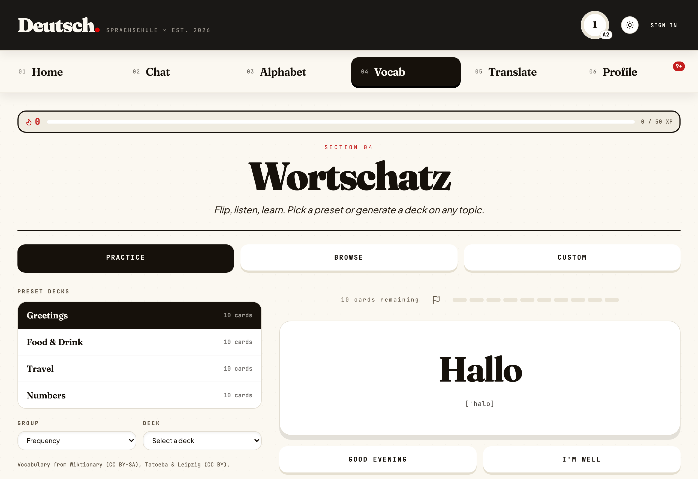
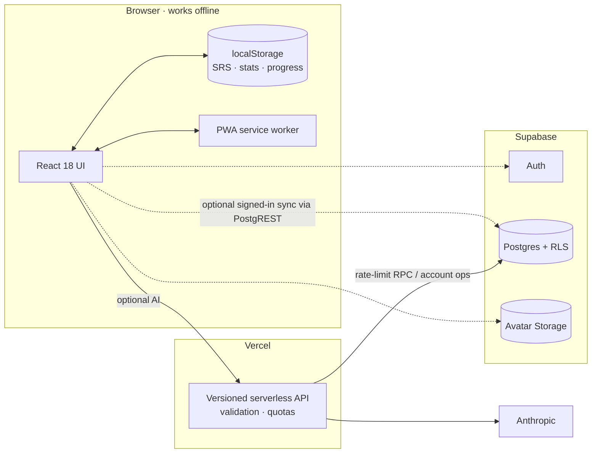

<div align="center">

<sup>SPRACHSCHULE · BUILT FOR CURIOUS MINDS</sup>

# Deutsch· — German practice with engineering depth

**An offline-first German-learning PWA that blends focused practice, deterministic
gamification, secure cross-device sync, and AI where it genuinely helps.**

[](https://deutsch-app-dusky.vercel.app)
[](https://github.com/blackhebrewisraeli/deutsch-app/actions/workflows/ci.yml)
[](https://react.dev/)
[](https://supabase.com/)
[](https://vercel.com/)
[](./LICENSE)

[Try the app](https://deutsch-app-dusky.vercel.app) ·
[Explore the superpowers](#-engineering-superpowers) ·
[Run it locally](#-quick-start) ·
[See the architecture](#-system-at-a-glance)

<!-- Screenshot placeholder: add docs/images/hero-dashboard.png -->


<sub>One app, six learning surfaces, and considerably more thought about merge semantics than a language app has any right to contain.</sub>

</div>

> [!NOTE]
> **Accounts are optional.** Core lessons, vocabulary, speech, SRS, progress,
> streaks, and quests work locally. Signing in adds cross-device sync, leagues,
> and a portable profile; generative features require the server API.

## ✨ What learners get

| Experience                                  | What it does                                                                                  |
| ------------------------------------------- | --------------------------------------------------------------------------------------------- |
| 💬 **Guided conversation**                  | An AI tutor sets level-aware scenarios, responds in character, and explains corrections.      |
| 🔤 **Alphabet & listening**                 | German speech synthesis, confusable-letter quizzes, and a browsable pronunciation grid.       |
| 🧠 **Vocabulary & SRS**                     | Active recall over preset, lexicon, grammar, and custom decks using Leitner scheduling.       |
| ✍️ **Adaptive translation**                 | A1 word tiles, A2 fill-in-the-blank drills, and meaning-aware B1 grading.                     |
| 🎮 **Motivation that respects the learner** | XP, streak freezes, achievements, daily quests, and optional weekly leagues.                  |
| 🛂 **Learning Passport**                    | A portable identity with handle, level, progress, league profile, and a secure custom avatar. |

<!-- Screenshot placeholders: replace these files as product captures become available. -->

|                                    Practice                                     |                                Learning Passport                                 |
| :-----------------------------------------------------------------------------: | :------------------------------------------------------------------------------: |
|  |  |

## 🦸 Engineering superpowers

<details open>
<summary><strong>🔌 Offline-first sync that understands different kinds of data</strong></summary>

The browser's `localStorage` is the offline authority; Supabase is an optional
cross-device layer. Reconciliation happens client-side before PostgREST upserts,
so each state slice gets semantics that fit its data instead of one risky
"newest blob wins" rule.

| State slice                  | Merge strategy                                 | Why                                                                                      |
| ---------------------------- | ---------------------------------------------- | ---------------------------------------------------------------------------------------- |
| Daily stats                  | **Additive delta** from a synced baseline      | Repeated syncs stay idempotent without losing offline activity.                          |
| SRS cards                    | **Per-card LWW** on `lastReviewed`             | Reviewing one card should not overwrite another card's state.                            |
| Settings                     | **Whole-record LWW**, with explicit carve-outs | Ordinary preferences share a clock; special data does not.                               |
| CEFR level                   | **Independent LWW clock**                      | A newer unrelated setting cannot roll B1 back to A1.                                     |
| Learned words & deck mastery | **Union merge**                                | Learning on either device remains learned.                                               |
| Custom decks                 | **Per-deck LWW + tombstones**                  | Offline deletion competes with edits by timestamp instead of resurrecting removed decks. |

Deck deletion is the interesting edge case. An upsert-only system cannot express
absence, so a stale device would recreate a deleted deck. Deutsch· keeps a
timestamped tombstone; the same per-deck LWW comparison then decides whether an
edit or deletion is newer.

Signed-in browser access to learner tables and avatar writes is protected by
Supabase Row Level Security. Adversarial tests exercise those policies through
real PostgREST requests, including cross-user reads, writes, updates, deletes,
and avatar-object ownership.

</details>

<details>
<summary><strong>🎯 Daily quests with deterministic variety and zero quest rows</strong></summary>

Three daily quests are derived—not stored—from a stable seed:

```js
seed = hash(`${userId ?? 'guest'}:${todayKey}`);
quests = pickQuestGroups(seed, 3);
progress = readExistingDailyCounters(todayKey);
```

The same learner gets the same quests all day, on every device, even offline.
There is no quest table to maintain, synchronize, or accidentally reshuffle.

Difficulty adapts without chasing outliers. Targets use the **median of the
previous seven days**, excluding today, then apply per-quest multipliers. A
single heroic study binge cannot make tomorrow miserable, and today's progress
cannot move today's goalposts.

Quests intentionally award achievements rather than XP. League XP stays tied to
actual graded practice, protecting the balance of a small, real learning loop.

</details>

<details>
<summary><strong>🤖 AI behind a narrow, validated server boundary</strong></summary>

AI powers conversational scenarios, custom deck generation, and B1
meaning-aware grading. Deterministic exercises remain deterministic: vocabulary,
A1 tiles, and A2 blanks do not call a model just to check an answer.

The browser calls only versioned same-origin endpoints:

```text
React client
   └── /api/v1/ai/{chat,grade,deck}
          ├── origin validation
          ├── per-route rate limiting
          ├── request schema validation
          └── Anthropic API (server-side key only)
```

The Anthropic key never enters the Vite bundle. Production quotas use an atomic
Postgres RPC when Supabase server credentials are configured, with an in-memory
development fallback.

</details>

<details>
<summary><strong>♿ Accessibility treated as a regression surface</strong></summary>

The accessibility bar is enforced by focused automated checks and semantic
components—not a promise in a footer.

- A Playwright CI audit checks rendered color contrast across themes, tones,
  tabs, viewports, modals, and drawers.
- A shared focus-trap hook keeps keyboard navigation inside active dialogs and
  restores focus to the opener.
- Source tests reject nested buttons and hardcoded component colors.
- Icon-only controls require accessible names.
- Interactive rows use native semantic controls with visible focus states.

The result is a UI designed for keyboard and screen-reader use while retaining
its bold editorial visual language.

</details>

<details>
<summary><strong>🖼️ Secure avatars without trusting the uploaded file</strong></summary>

The Learning Passport avatar pipeline is deliberately ordered:

1. The client validates and re-encodes the image as WebP, stripping EXIF data.
2. It uploads to a random, user-owned path in Supabase Storage.
3. The profile API records the new path.
4. The previous object is removed on a best-effort basis.

Storage policies restrict writes and deletes to the authenticated user's folder.
If no image exists, a deterministic identicon provides a stable, zero-storage
fallback.

</details>

## 🧭 System at a glance



> The server stores reconciled state; it does not perform learner-progress
> merges. Keeping merge rules in pure client-side functions makes them
> deterministic, testable, and usable before the network returns.

## 🛠️ Tech stack

| Layer            | Technology                                                      | Role                                                                |
| ---------------- | --------------------------------------------------------------- | ------------------------------------------------------------------- |
| UI               | **React 18**, Vite 5                                            | Component architecture, fast local development, production bundling |
| Offline          | **PWA / Workbox**, `localStorage`                               | App-shell caching and local-first learner state                     |
| Data             | **Supabase Postgres**                                           | Durable account data, rate limits, leagues, and sync tables         |
| Data API         | **PostgREST** via Supabase                                      | RLS-protected browser reads and writes                              |
| Identity & media | **Supabase Auth + Storage**                                     | Optional accounts and user-owned avatars                            |
| Server           | **Vercel Functions**                                            | Versioned AI and account endpoints; secrets stay server-side        |
| AI               | **Anthropic Claude**                                            | Conversation, deck generation, and B1 grading                       |
| Quality          | **Vitest, React Testing Library, Playwright, ESLint, Prettier** | Unit, integration, policy, contrast, lint, and format checks        |

## ⚡ Quick start

### Core app (no account or AI secrets required)

**Prerequisites:** Node.js 20+ and npm.

```bash
git clone https://github.com/blackhebrewisraeli/deutsch-app.git
cd deutsch-app
npm install --legacy-peer-deps
npm run dev
```

Open [http://localhost:5173](http://localhost:5173). The offline-first learning
flows work without Supabase, Vercel, or Anthropic credentials.

### Accounts, sync, leagues, and avatars

**Additional prerequisite:** Docker and the Supabase CLI.

```bash
supabase start
cp .env.example .env
supabase status -o env
```

`.env.example` intentionally contains this dummy value:

```dotenv
SUPABASE_SERVICE_ROLE_KEY=your_local_service_role_key_here
```

After `supabase start`, copy the local `SERVICE_ROLE_KEY` printed by
`supabase status -o env` into `SUPABASE_SERVICE_ROLE_KEY` in `.env`. It belongs
only to the local `127.0.0.1` stack. **Never place a cloud service-role key in a
local environment file**—that role bypasses RLS.

Enable only the client features you want to exercise:

```dotenv
VITE_SYNC_ENABLED=true
VITE_LEAGUES_ENABLED=true
```

Then restart `npm run dev`.

### Full app with AI endpoints

Add a development `ANTHROPIC_API_KEY`, link the repository to Vercel, and run:

```bash
npx vercel link
npm run dev:full
```

`npm run dev:full` serves the Vite app and `/api` functions together. Use
`npm run dev` for UI and offline-first work that does not need AI.

<details>
<summary><strong>Useful commands</strong></summary>

| Command                  | Purpose                                                      |
| ------------------------ | ------------------------------------------------------------ |
| `npm run dev`            | Start the Vite UI                                            |
| `npm run dev:full`       | Start Vite plus Vercel functions                             |
| `npm run build`          | Create the production PWA                                    |
| `npm test`               | Run the main Vitest suite                                    |
| `npm run test:rls`       | Run PostgREST/RLS adversarial tests; requires local Supabase |
| `npm run lint`           | Run ESLint                                                   |
| `npm run format:check`   | Check formatting                                             |
| `npm run audit:contrast` | Audit rendered contrast with Playwright                      |

</details>

## 🧪 Quality philosophy

The project favors invariants over happy-path demos:

- Merge functions are tested independently from the sync orchestrator.
- RLS tests attack the database as anonymous users, owners, and non-owners.
- AI request validation and per-route quota contracts are tested server-side.
- Accessibility checks cover source structure and rendered UI.
- The pre-commit hook runs lint-staged checks plus the complete main test suite.

Every pull request also runs CI against the same architecture that ships.

## 🗺️ Repository map

```text
api/                    Vercel functions and shared server middleware
src/components/         Learning surfaces and accessible UI primitives
src/lib/                SRS, sync, gamification, quests, auth, and avatars
src/packs/de/           German content-pack behavior
supabase/migrations/    Schema, grants, RLS policies, functions, and Storage
supabase/tests/rls/     Adversarial PostgREST policy tests
docs/api/               Versioned API contracts
docs/superpowers/       Architecture decisions and implementation plans
```

## 🤝 Explore, learn, contribute

This repository is both a working product and a study in local-first application
design. Good starting points include:

- tracing one state slice through `src/lib/sync/`,
- reading the adversarial policy tests in `supabase/tests/rls/`,
- exploring deterministic quest generation in `src/lib/quests.js`, or
- trying a preset vocabulary deck offline.

Bug reports, accessibility findings, architecture questions, and focused pull
requests are welcome. Please read [`AGENTS.md`](./AGENTS.md) before making code
changes; it records the project's conventions and product boundaries.

## 📄 License

Released under the [MIT License](./LICENSE). Vocabulary sources and attribution
are documented separately in [`CONTENT_LICENSE.md`](./CONTENT_LICENSE.md).

<div align="center">

**Built to help people learn German—and to make the hard parts of frontend
engineering visible.**

[Launch Deutsch·](https://deutsch-app-dusky.vercel.app) ·
[Back to top](#deutsch-german-practice-with-engineering-depth)

</div>
