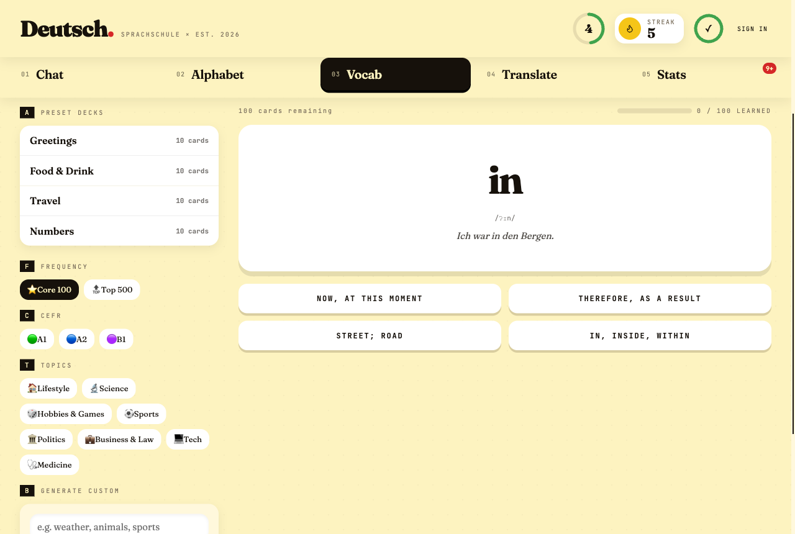
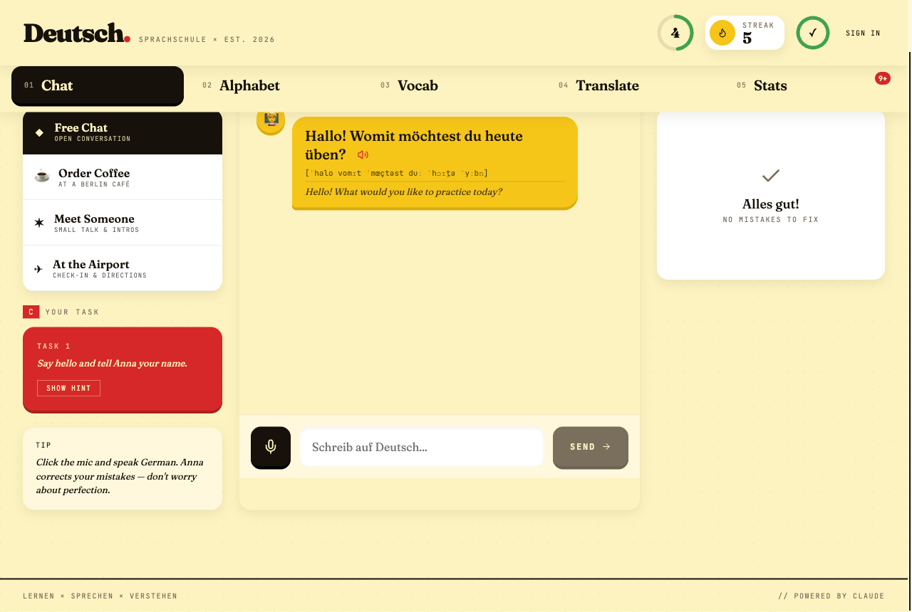
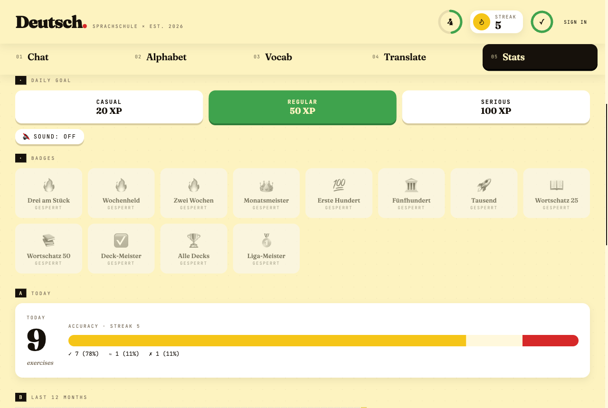
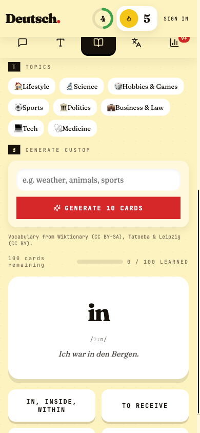
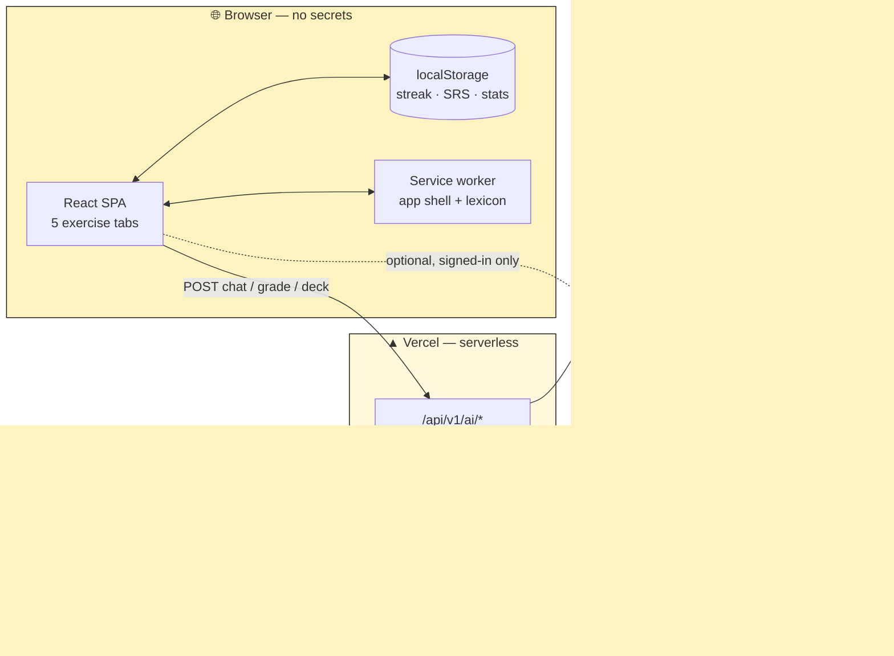

<div align="center">

<br/>

<sup>S P R A C H S C H U L E &nbsp;×&nbsp; E S T .&nbsp; 2 0 2 6</sup>

# Deutsch·

### _A guided German learning app — AI tutor, exercise-driven practice, installable PWA_

<p>
  <a href="https://deutsch-app-dusky.vercel.app"></a>
  &nbsp;
  <a href="https://github.com/blackhebrewisraeli/deutsch-app/actions/workflows/ci.yml"></a>
  &nbsp;
  
  &nbsp;
  
  &nbsp;
  
  &nbsp;
  
</p>

<p>
  
  &nbsp;
  
  &nbsp;
  
  &nbsp;
  
  &nbsp;
  
</p>

<p>
  <a href="#-quick-start"><b>▶ Run it locally</b></a> &nbsp;·&nbsp;
  <a href="#-features"><b>See the features</b></a> &nbsp;·&nbsp;
  <a href="#-how-it-works"><b>How it works</b></a>
</p>

<br/>

<a href="https://deutsch-app-dusky.vercel.app">
  
</a>

<sub><i>Active recall over a 4,288-word lexicon — every card carries IPA, an example sentence, gender and plural.</i></sub>

<br/>

</div>

---

## Contents

> **Most sections below are collapsed.** Click any ▸ heading to expand it —
> the page is meant to be skimmed first and read in whatever order you like.

<table>
<tr><td width="33%" valign="top">

#### 🚀 Get going

|     |                                      |
| --- | ------------------------------------ |
| 🎯  | [What is this?](#what-is-this)       |
| 📋  | [At a glance](#at-a-glance)          |
| ⚡  | [**Quick Start**](#-quick-start)     |
| 📊  | [Learning levels](#-learning-levels) |

</td><td width="33%" valign="top">

#### 📚 Using the app

|     |                                                               |
| --- | ------------------------------------------------------------- |
| ✦   | [**Features**](#-features) — 6 tabs                           |
| 🇩🇪  | [Grammar & vocabulary](#-german-grammar--vocabulary-coverage) |
| 📖  | [Importing vocabulary](#-importing-vocabulary)                |
| 🌐  | [Browser support](#-browser-support)                          |

</td><td width="33%" valign="top">

#### 🔧 Under the hood

|     |                                                   |
| --- | ------------------------------------------------- |
| ⚙️  | [How it works](#-how-it-works)                    |
| 🛠️  | [Tech stack](#-tech-stack)                        |
| 🌍  | [Architecture](#-multi-language-architecture)     |
| 🛡️  | [Security & roles](#-security--role-architecture) |
| 🚀  | [Deploy](#-deploy-to-production)                  |
| 📁  | [Project structure](#-project-structure)          |

</td></tr>
</table>

<div align="center">

**New here?** → [What is this?](#what-is-this) &nbsp;·&nbsp;
**Want to run it?** → [Quick Start](#-quick-start) &nbsp;·&nbsp;
**Just browsing?** → [Features](#-features)

</div>

---

## What is this?

**Deutsch · Sprachschule** is an exercise-driven German learning app that runs in the browser and installs as a PWA. It does not wait for you to know what to do — it gives you a task, you respond, and it tells you whether you got it right.

The app covers **three CEFR proficiency levels** (A1 · A2 · B1) across four exercise modules — guided conversation, alphabet recognition, vocabulary active recall, and translation — plus a **Stats tab** that records every interaction and resurfaces what you got wrong. Vocab draws on a **4,288-word German lexicon** — each entry with gender, plural, IPA, example sentences, and verb conjugation — scheduled by a **Leitner spaced-repetition** algorithm, so cards return at the right time, not on every visit.

All AI features call **Claude Haiku 4.5** through a versioned server-side API (`/api/v1/ai/*` — validated, rate-limited, [contract-documented](./docs/api/ai.md)) — your API key never touches the browser.

**Accounts are optional.** Everything works anonymously and offline; signing in adds cross-device sync and weekly leagues, nothing more.

---

## At a glance

|                    |                                                                                                                        |
| ------------------ | ---------------------------------------------------------------------------------------------------------------------- |
| **Live**           | [deutsch-app-dusky.vercel.app](https://deutsch-app-dusky.vercel.app) — installable PWA, works offline after first load |
| **Tabs**           | 6 — Home · Chat · Alphabet · Vocab · Translate · Stats (Chat/Alphabet/Vocab/Translate are the practice modules)        |
| **Levels**         | A1 · A2 · B1, each with its own exercise mode                                                                          |
| **Vocabulary**     | 4,288 words · 32 generated decks + 4 hand-written starter decks + your own AI decks                                    |
| **Grammar drills** | 7 deck groups — der/die/das, plurals, Perfekt, Präsens, Präteritum, opposites, listening                               |
| **Scheduling**     | Leitner spaced repetition, 5 boxes (1d → 30d)                                                                          |
| **Sign-in**        | Optional — email code or **Continue with Google**; anonymous progress merges in on first sign-in                       |
| **Social**         | Weekly XP leagues, ~25-person cohorts, promotion / relegation                                                          |
| **Gamification**   | Streaks with freezes · 15 badges · 3 daily quests, derived not stored                                                  |
| **Custom decks**   | Up to 8 AI-generated decks, named, synced, deletable across devices                                                    |
| **AI**             | Claude Haiku 4.5 behind `/api/v1/ai/*` — key stays server-side                                                         |
| **Data**           | Local-first (`localStorage`), optional Supabase sync under row-level security                                          |
| **Quality gates**  | 2,259 tests · 30 adversarial RLS tests · lint + format + full suite on every commit                                    |

---

## 🦸 Superpowers

> Four things this app does that a weekend project usually does not. Each one is a
> deliberate architectural choice, and each has the scar tissue to prove it.

<table>
<tr>
<td width="25%" align="center"><h3>🔌</h3><b>Offline-first</b><br/><sub>Conflict-free sync</sub></td>
<td width="25%" align="center"><h3>🎮</h3><b>Deep gamification</b><br/><sub>Zero server cost</sub></td>
<td width="25%" align="center"><h3>🤖</h3><b>AI-powered</b><br/><sub>Key never ships</sub></td>
<td width="25%" align="center"><h3>♿</h3><b>Inclusive by gate</b><br/><sub>CI enforces it</sub></td>
</tr>
</table>

<details open>
<summary><h3>🔌 &nbsp;Offline-first, with a sync engine that actually resolves conflicts</h3></summary>

<br/>

`localStorage` is the source of truth. The network is an optimisation. Everything works
on a plane; signing in adds a second device, not a dependency.

The hard part is not _storing_ — it is what happens when two devices disagree. There is no
server-side merge logic and no last-writer-wins-everything shortcut. **Each slice of state gets
the merge strategy its data model actually deserves:**

| Slice             | Strategy                                     | Why that one                                                                     |
| ----------------- | -------------------------------------------- | -------------------------------------------------------------------------------- |
| `stats_daily`     | **Additive delta** against a synced baseline | Counters only ever increase; a repeated sync must be a no-op, not a double-count |
| `srs_state`       | **Per-card LWW** on `lastReviewed`           | Cards are independent records — one card's review says nothing about another's   |
| `settings`        | **Whole-blob LWW**, with carve-outs          | One row, one clock — except where that is wrong (below)                          |
| `learnedWords`    | **Union**                                    | A word learned on either device is learned. Nobody un-learns                     |
| `learned_by_deck` | **Union, per deck**                          | Mastery belongs to the deck it was earned in                                     |
| `decks`           | **Per-deck LWW** + **tombstones**            | A deck is an independent record — and the only thing here you can _delete_       |

Three of those exist because the simple version broke something real:

> **`level` has its own clock.** Whole-row LWW once dragged a learner's level from B1 back to
> A1, because an _unrelated_ newer write on a stale device won the row. `level` now carries
> `levelUpdatedAt`, independent of `settingsUpdatedAt`.

> **Deletion needed tombstones.** Every other table is grow-only, so the engine had never had
> to express "this is gone" — and an upsert-only merge silently resurrected any deck you
> deleted offline. A tombstone is simply the record whose most recent write was a removal, so
> per-deck LWW compares a deletion against an edit with no special case at all.

> **You cannot delete from a union.** The corollary nobody expects: removing a key from a
> union-merged map does not stick, because the other device pushes it straight back. That is
> why the legacy mastery map is still there, mirrored rather than pruned, until every client
> has updated.

A **30-test adversarial RLS suite** attacks the database policies through real PostgREST —
every cross-user read, write, update and delete, plus the ones you only think of after
something goes wrong ("can A tombstone B's deck?").

</details>

<details>
<summary><h3>🎮 &nbsp;Gamification that costs the server nothing</h3></summary>

<br/>

Streaks with earned freezes, XP multipliers, 15 badges, weekly leagues in ~25-person cohorts
with promotion and relegation — and **three daily quests that are never stored anywhere.**

Today's quests are a pure function of `hash(userId + todayKey)`. Same learner, same day, same
three quests — on every device, offline, with nothing synced between them. Progress is read
straight off counters the app already keeps.

```js
seed = hash(`${userId}:${todayKey}`); // same everywhere, shared with nobody
quests = pick(CATALOGUE, seed, 3); // stable all day; cannot reshuffle mid-scroll
progress = read(daily[todayKey]); // a counter that already exists
```

**The rule that keeps it honest:** a quest whose progress cannot be derived from an existing
counter gets cut, not given storage. "Clear your due pile" did not survive it — progress would
have been _(due at midnight − due now)_, and the starting figure is nowhere recorded.

Targets scale to the learner. The typical day here is **four answers**, so a flat "answer 10
cards" would be a wall of failure; the bar is a _median_ of the trailing week, excluding today
(a mean lets one 22-answer binge set tomorrow's target, and including today makes the goal
chase the progress).

> **Quests grant no XP — deliberately.** XP feeds the weekly leagues through one shared
> formula. The best week this league has on record is **206 XP**; three daily quests at ten XP
> would be 210 a week without answering a single card. There is no "small" XP reward at this
> scale, so the reward is badges. Game balance beat the feature.

</details>

<details>
<summary><h3>🤖 &nbsp;AI where it helps, and nowhere it doesn't</h3></summary>

<br/>

**Claude Haiku 4.5** behind a versioned, validated, rate-limited server API. The key lives in
Vercel and never reaches the browser — the client's only external call is to the app's own
origin.

| Feature                      | What it does                                                                               |
| ---------------------------- | ------------------------------------------------------------------------------------------ |
| **Custom decks**             | Type a topic, get ten cards with IPA and glosses — up to 8 decks, named, synced, deletable |
| **Conversational scenarios** | Anna gives you a task in German; you answer; she responds in character                     |
| **Free-typing grades (B1)**  | Your translation is graded on meaning, not string equality                                 |
| **Corrections**              | What you wrote, what was wrong, and why — not just a red cross                             |

Every call is contract-documented ([`docs/api/ai.md`](./docs/api/ai.md)), schema-validated at
the edge, and quota-limited per IP through an atomic Postgres RPC — so a burst cannot be turned
into a bill.

The drills that AI _cannot_ improve do not use it. Gender, plural and participle answers are
graded by exact match against the pack's rules, because a near-miss on `der`/`die` is a
different word, not a close attempt.

</details>

<details>
<summary><h3>♿ &nbsp;Accessibility as a build gate, not a good intention</h3></summary>

<br/>

Every interactive row is a real `<button>`. That sounds obvious until you find fourteen
leaderboard rows shipped as `<li onClick>` — clickable with a mouse, invisible to Tab, and
green through a 1,600-test suite the whole time.

| Guard                    | What it enforces                                                                                         |
| ------------------------ | -------------------------------------------------------------------------------------------------------- |
| **Contrast gate in CI**  | Audits the _rendered DOM_ of every screen, including modals and drawers                                  |
| **`useFocusTrap`**       | One hook, after three ad-hoc versions each leaked focus out of an open dialog                            |
| **No nested buttons**    | A source-level test — a `<button>` inside a `<button>` is invalid and browsers silently un-nest it       |
| **No hardcoded colours** | Every colour comes from a design token, so themes cannot drift                                           |
| **Named icon controls**  | An icon-only control carries an explicit accessible name — a sparkle glyph tells a screen reader nothing |

Copy lives in the language pack, never in `src/lib` or `src/components` — enforced by a test.
The engine stays language-blind, which is what makes a second pack a content problem rather
than a rewrite.

> One of these gates was **green for weeks while auditing the wrong screen.** It passed because
> CI lacked the Supabase environment a developer has, so it silently tested a signed-out view.
> It now provisions its own signed-in account. A gate that cannot fail is not a gate.

</details>

---

## 📊 Learning Levels

Choose your level on the splash screen. It is stored in `localStorage` and drives the exercise mode in every tab.

|         Level         | CEFR description                                               | Exercise mode                                                                             |
| :-------------------: | -------------------------------------------------------------- | ----------------------------------------------------------------------------------------- |
|   **A1 — Beginner**   | You know basic vocabulary and can form simple sentences        | **Word tiles** — all German words provided; assemble them in the correct order            |
|  **A2 — Elementary**  | You can handle familiar situations with some grammar knowledge | **Fill the blanks** — sentence shown with 2–3 key words missing; select from a tile bank  |
| **B1 — Intermediate** | You can describe experiences and explain opinions in German    | **Free typing + AI grading** — translate the sentence yourself; Claude grades your answer |

You can change your level at any time from the header's status control or the Stats tab — no need to sign out or clear onboarding state. Switching level while a set is in progress asks for confirmation first, since it discards the current run. Signed-in learners additionally earn a per-level XP multiplier (named in Settings), rewarding practice at a harder level.

---

## ✦ Features

<table>
<tr>
<td width="50%" valign="top">

<br/><sub><b>01 · Chat</b> — Anna sets a task, corrects your grammar inline, and advances when you complete it.</sub>
</td>
<td width="50%" valign="top">

<br/><sub><b>05 · Stats</b> — every graded answer, turned into goals, badges and an accuracy breakdown.</sub>
</td>
</tr>
</table>

<div align="center">

<br/><sub><b>Installable PWA</b> — the full app on a phone. Verified clean from 320px up; offline reload confirmed on-device.</sub>
</div>

<br/>

Each module below is collapsed — click to open.

<details>
<summary><b>01 · Chat</b> — Guided conversation with an AI tutor that sets you a task</summary>
<br/>

Anna, your AI tutor, does not wait for you to speak. She opens each session with a **task suited to your level** and guides you toward completing it.

**How tasks work:**

```
╔══════════════════════════════════╗
║  C  YOUR TASK                    ║
║  ─────────────────────────────── ║
║  TASK 1                          ║
║  "Order a large coffee and ask   ║
║   how much it costs."            ║
║                                  ║
║  [SHOW HINT]                     ║
╚══════════════════════════════════╝
```

Hints are available (always visible for A1, toggle for A2, hidden for B1). When Claude detects the task is naturally complete, the panel advances to the next task automatically.

**Four scenarios, three difficulty levels each:**

| Scenario         | A1 example task                            | B1 example task                                                      |
| ---------------- | ------------------------------------------ | -------------------------------------------------------------------- |
| ◆ Free Chat      | "Say hello and tell Anna your name."       | "Tell Anna about a problem you had recently and how you solved it."  |
| ☕ Order Coffee  | "Order a coffee."                          | "Complain politely that your order is wrong."                        |
| ✶ Meet Someone   | "Ask Anna her name and where she is from." | "Have a natural small-talk conversation about your week."            |
| ✈ At the Airport | "Ask where the check-in desk is."          | "Explain that your flight was cancelled and ask about your options." |

**Inline grammar correction:**

Every reply is evaluated. If you make a mistake, the correction panel shows:

```
⚠  NEEDS A FIX
──────────────────────────────────────────────────
YOU SAID   →   Ich lerne Deutsch seit drei Monat.
CORRECT    →   Ich lerne Deutsch seit drei Monaten.   [ HEAR IT ]

"After 'seit' (since), use the dative case.
'Monat' → 'Monaten' (plural dative)."
──────────────────────────────────────────────────
```

**Anna's JSON response schema (what Claude returns on every turn):**

```json
{
  "de": "Willkommen! Was darf ich Ihnen bringen?",
  "ipa": "[vɪlˈkɔmən vas daʁf ɪç ˈiːnən ˈbʁɪŋən]",
  "en": "Welcome! What can I bring you?",
  "correction": null,
  "taskComplete": false
}
```

When `taskComplete` is `true`, the task panel advances to the next task for the current scenario.

</details>

---

<details>
<summary><b>02 · Alphabet</b> — Hear a letter, pick it out of four confusable neighbours</summary>
<br/>

Two modes behind a toggle:

**Quiz mode (default):** A letter is spoken aloud by the browser's German TTS voice. Four confusable letter options are shown — tap the one you heard. Score tracked per session.

```
ROUND 4 · SCORE 3/3 · WHICH LETTER DID YOU HEAR?

        🔊   TAP TO HEAR AGAIN

    ┌──────┐  ┌──────┐
    │  U   │  │  Ü   │ ← correct
    ├──────┤  ├──────┤
    │  O   │  │  Ö   │
    └──────┘  └──────┘
```

**Letter groups are chosen for maximum confusion value** — letters that German learners commonly mishear:

| Group | Letters       | Why confusable                |
| :---: | ------------- | ----------------------------- |
|   1   | U · Ü · O · Ö | Front/back vowel pairs        |
|   2   | A · Ä · E · I | Short vowel spectrum          |
|   3   | S · ß · Z · W | Sibilants and voiced variants |
|   4   | B · P · D · T | Voiced/unvoiced pairs         |
|   5   | V · W · F · B | Labial consonants             |
|   6   | G · K · J · Y | Velar and palatal consonants  |
|   7   | R · L · N · M | Liquids and nasals            |
|   8   | H · X · Q · C | Rare / silent letters         |

**Browse mode:** The full 30-letter grid (A–Z + Ä · Ö · Ü · ß). Click any letter to hear it spoken, see an example word, and read its English meaning.

</details>

---

<details>
<summary><b>03 · Vocab</b> — Active recall over a 4,288-word lexicon, scheduled by SRS</summary>
<br/>

Cards never just flip to reveal the answer — you have to produce it first.

**A1 / A2 — Multiple choice (4 options):**

```
CARD 4 / 10 · WHAT DOES THIS MEAN?

┌────────────────────────────────────┐
│                                    │
│         der Hund                   │
│     [deːɐ̯ hʊnt]                   │
│                                    │
└────────────────────────────────────┘

  ┌──────────┐   ┌──────────┐
  │   cat    │   │   dog ✓  │  ← gold flash
  ├──────────┤   ├──────────┤
  │   horse  │   │   bird   │
  └──────────┘   └──────────┘
```

**B1 — Type the meaning:**

```
CARD 4 / 10 · TRANSLATE THIS WORD

┌────────────────────────────────────┐
│           der Hund                 │
└────────────────────────────────────┘

  [ dog                           ]  ← text input
  [ CHECK → ]
```

Answers within **Levenshtein distance ≤ 2** (one or two typos) are marked **ALMOST** and advance the card. Wrong answers return to the back of the queue — the deck never completes until every card is answered correctly at least once.

**Starter decks** — four hand-written decks of 10 cards, always available offline:

| Deck         | Sample words                                   |
| ------------ | ---------------------------------------------- |
| Greetings    | Hallo, Guten Morgen, Tschüss, Wie geht es dir? |
| Food & Drink | das Brot, der Kaffee, die Milch, der Apfel     |
| Travel       | der Bahnhof, der Pass, links, geradeaus        |
| Numbers      | eins through zehn                              |

**The lexicon — 4,288 words.** Beyond the starter decks the app ships a full German
lexicon, imported from open datasets and lazy-loaded in chunks (cached for offline
use after first visit). Every entry carries far more than a translation:

| Field                 | Example (`das Haus`)                                   |
| --------------------- | ------------------------------------------------------ |
| Article / gender      | `das`                                                  |
| Plural                | `Häuser`                                               |
| IPA                   | `[haʊ̯s]`                                               |
| Example sentence      | _Auf dem Hügel steht ein Haus._                        |
| Verb conjugation      | present tense, Präteritum, Partizip II, `haben`/`sein` |
| Opposites             | `Ende ↔ Anfang` (124 curated pairs)                    |
| Frequency rank + CEFR | rank 456 · A1                                          |

Those entries are sliced into **26 decks** you can jump between:

| Group         | Decks                                                                                 |
| ------------- | ------------------------------------------------------------------------------------- |
| **Frequency** | Core 100, Top 500 — the most common words first                                       |
| **CEFR**      | A1 (858) · A2 (1,286) · B1 (2,144) — banded by position in the lexicon                |
| **Topics**    | Lifestyle, Science, Hobbies & Games, Sports, Politics, Business & Law, Tech, Medicine |

**Grammar drills — seven deck groups that ask you to _produce_ a form, not recognise it.**
Each reuses the same lexicon, hides whatever would give the answer away, and is
scheduled by the same SRS. None of them mark a word "learned" — knowing a noun's
gender is not knowing the noun.

| Drill          | Asks for                       | Why it is worth drilling                                      |
| -------------- | ------------------------------ | ------------------------------------------------------------- |
| **Artikel**    | der / die / das                | gender is not derivable — 2,863 nouns                         |
| **Plural**     | the plural form                | German has no single plural rule                              |
| **Perfekt**    | `hat gemacht` / `ist gegangen` | auxiliary choice plus the participle                          |
| **Präsens**    | the `du` form                  | the least predictable person (irregular stem changes)         |
| **Präteritum** | `sah`, `ging`, `war`           | the written past — strong verbs are pure memorisation         |
| **Gegenteil**  | the opposite                   | `dunkel` cannot be derived from `hell` — 124 curated pairs    |
| **Hören**      | type what you hear             | 51% of entries contain a grapheme you cannot infer from sound |

Word data comes from Wiktionary (via Wiktextract), example sentences from Tatoeba,
and frequency ranking from the Leipzig Corpora Collection — see
[Importing vocabulary](#-importing-vocabulary) for the one-command import and
[CONTENT_LICENSE.md](./CONTENT_LICENSE.md) for attribution.

**AI-generated decks:** Type any topic — _colours, animals, at the doctor's, football_ — and Claude generates a 10-card deck with German articles for nouns, IPA, and English meanings.

</details>

---

<details>
<summary><b>04 · Translate</b> — Translate a sentence — tiles, blanks, or free typing by level</summary>
<br/>

The app gives you a sentence. You translate it. The exercise mode depends on your level.

**A1 — Word tiles:**

```
TRANSLATE TO GERMAN
"I drink water."

YOUR ANSWER ─────────────────────────────────
  [ Ich ] [ trinke ]  ← placed tiles (click to return)

WORD BANK ───────────────────────────────────
  [ Wasser. ]  [ esse ]  [ laufe ]

[ CHECK → ]  [ ⏭ skip ]
```

**A2 — Fill the blanks:**

```
TRANSLATE TO GERMAN
"The child plays with the ball."

COMPLETE THE SENTENCE
  Das Kind spielt mit ___ Ball.

  [ der ]  [ den ]  [dem] ← correct  [ die ]

[ CHECK → ]  [ ⏭ skip ]
```

**B1 — Free typing + AI grading:**

```
TRANSLATE TO GERMAN
"Despite the rain, we enjoyed the walk."

  ┌────────────────────────────────────────┐
  │ Trotz des Regens haben wir den        │
  │ Spaziergang genossen.                  │
  └────────────────────────────────────────┘

[ CHECK →  ]  [ ⏭ skip ]

✓ CORRECT ───────────────────────────────────
  "Great use of 'trotz + genitive' and
   Perfekt with haben."
[ NEXT EXERCISE → ]
```

**B1 grading prompt schema (what Claude returns):**

```json
{
  "verdict": "correct",
  "corrected": "Trotz des Regens haben wir den Spaziergang genossen.",
  "message": "Perfect. Note: 'trotz' always takes genitive — des Regens, not dem Regen."
}
```

`verdict` is `"correct"`, `"almost"`, or `"wrong"`. Both **correct** and **almost** advance the exercise.

When the **built-in sentence bank** (10 sentences per level) is exhausted, Claude generates 5 fresh sentences on demand and appends them — the exercise never runs out.

</details>

---

### Progress tracking

A single header **StatusChip** — merging what used to be a separate XP badge and CEFR chip — shows **level**, **streak**, and **daily goal** progress (XP-derived), persisted in `localStorage`:

- **Level badge** — XP from all graded exercises; rank names (Anfänger → Fließend, …); tap to open the shared `LevelSwitcher` and change CEFR level on the spot
- 🔥 **Streak** — consecutive days with at least one visit
- **Goal ring** — today's XP vs. daily target (configurable in Stats)

The **05 Stats** tab shows total XP, learned-word count, achievements, and goal/sound settings. A red badge on the Stats nav tab shows how many items are waiting for review (wrong answers + due vocab cards), capped at "9+". Six practice dashboards — see the next section.

---

<details>
<summary><b>05 · Stats</b> — Six dashboards over every graded interaction</summary>
<br/>

A dedicated tab that records every graded interaction across the four exercise modules and turns them into an at-a-glance picture of practice.

```
╔══════════════════════════════════════════════════════════════════╗
║  TODAY                                                            ║
║  12  exercises    ACCURACY · STREAK 4                             ║
║                  [████████░░░░██░░] ✓ 8 (67%) ≈ 2 (17%) ✗ 2 (16%) ║
╚══════════════════════════════════════════════════════════════════╝
```

**Six sections (A–F):**

| #   | Section                        | Shows                                                                                                                      |
| --- | ------------------------------ | -------------------------------------------------------------------------------------------------------------------------- |
| A   | **Today**                      | Today's total exercises, three-way accuracy bar (correct / almost / wrong), streak count                                   |
| B   | **Last 12 months**             | GitHub-style heatmap of daily activity (53 weeks × 7 days, 5 intensity buckets)                                            |
| C   | **By section**                 | Horizontal bars: Chat / Alphabet / Vocab / Translate. Most-practised tab is highlighted red.                               |
| D   | **Accuracy by level**          | Three-way stacked bars per CEFR level (A1 / A2 / B1)                                                                       |
| E   | **Review — tap to re-attempt** | Up to 10 most-recently-wrong items. Click a row → jump straight to that exercise with the item pre-loaded.                 |
| F   | **Vocab review queue**         | DUE NOW count + mastered progress bar (out of 40 cards) + per-deck breakdown (Greetings / Food & Drink / Travel / Numbers) |

**Storage:** all event data is forward-only — past practice is not backfilled. Schema extends `deutsch-app-state-v1`:

```js
{
  stats:        { streak, learnedCount, lastVisit },
  learnedWords: { '<de>': bool },
  daily:        { 'YYYY-MM-DD': { total, byTab, byLevel: { a1, a2, b1: { correct, almost, wrong } } } },
  items:        { '<tab>:<context>:<label>': { tab, context, label, detail, lastVerdict, lastTs, attempts, wrongCount } },
  srs:          { '<deckId>:<id>': { box, lastReviewed, nextDue, reps } },
  gamification: { goal, soundOn, achievements, lastGoalMet },
}
```

**Spaced repetition (Leitner):** Vocab cards live in 5 boxes with intervals 1d / 3d / 7d / 14d / 30d. After each card you pick **Hard / Good / Easy** (or **Again** on a wrong answer) and the system schedules the next review accordingly. Box 5 = mastered. The Vocab queue is ordered _due first → new → over-review_, so you always start with what needs you most.

</details>

---

<details>
<summary><b>06 · Leagues</b> — optional weekly XP competition, for signed-in learners</summary>
<br/>

Signing in unlocks a weekly league on the Stats tab. It is entirely optional — everything else in the app works anonymously.

```
LIGA · WOCHE 31                          ends in 2d 4h
──────────────────────────────────────────────────────
  ▲ PROMOTION ZONE
  1  anna_b          1,240 XP
  2  you               980 XP   ← highlighted
  3  markus            910 XP
  ─────────────────────────────
  …
  ▼ RELEGATION ZONE
```

|              |                                                                                 |
| ------------ | ------------------------------------------------------------------------------- |
| **Cohort**   | ~25 learners, assigned on join                                                  |
| **Scoring**  | XP earned during the week, from the same graded exercises that drive your level |
| **Movement** | Top of the table promotes, bottom relegates, settled by a scheduled cron        |
| **Reward**   | A _Liga-Meister_ badge for finishing first                                      |

Leagues run on the Supabase lane under the same row-level security as sync: you can read your cohort's standings and write only your own row. The weekly settle runs server-side behind `CRON_SECRET`.

</details>

---

## 🇩🇪 German Grammar & Vocabulary Coverage

<details>
<summary>▸ <b>Grammar topics and vocabulary domains, level by level</b></summary>

<details>
<summary><b>Grammar drilled at each level</b> — A1 word order · A2 cases &amp; adjective endings · B1 Konjunktiv, Perfekt, relative clauses</summary>
<br/>

### Grammar topics by level

**A1 — Word order and basic conjugation**

- Subject–Verb–Object sentence structure
- Present tense conjugation: `ich bin / habe / gehe / trinke / lese`
- Nominative articles: `der / die / das` + gender recognition
- Basic negation and simple adjective agreement

**A2 — Cases, prepositions, and adjective endings**
| Grammar point | Example from exercise bank |
|---|---|
| Accusative masculine | _einen großen Hund_ (ein → einen; groß → großen) |
| Movement vs. location | _in die Schule_ (acc.) vs. _in der Schule_ (dat.) |
| Dative after prepositions | _mit dem Ball, zu meinem Freund_ |
| Contractions | _ins = in + das, im = in + dem, zum = zu + dem_ |
| Possessives in dative | _ihrem Freund_ (dative masculine) |
| Adjective endings after definite article | _Das rote Auto_ (neuter nom. → -e) |

**B1 — Complex structures and mood**
| Grammar point | Example from exercise bank |
|---|---|
| Perfekt with _sein_ | _bin … gegangen_ (movement verb) |
| Perfekt with _haben_ | _habe … gekauft, genossen_ |
| Konjunktiv II | _hätte, würde + infinitive_ |
| seit + present tense | _Er wohnt seit drei Jahren …_ |
| Modal verbs | _Ich muss … fertigstellen_ (verb-final) |
| Relative clauses | _Die Frau, deren Tasche …_ (genitive _deren_) |
| trotz + genitive | _Trotz des Regens …_ |
| Indirect speech | _dass … kommen würde_ (verb-final) |
| Conditional perfect | _hätte … angerufen, wenn … gewusst hätte_ |
| Indirect questions | _Könnten Sie sagen, wo … ist?_ |

### Vocabulary domains

The built-in content covers these semantic fields across all levels:

- **Greetings & social phrases** — Hallo, Auf Wiedersehen, Wie geht es dir?
- **Food & drink** — das Brot, der Kaffee, die Milch, das Bier
- **Travel & transport** — der Bahnhof, der Flughafen, links, geradeaus
- **Numbers** — eins through zehn
- **Daily objects** — das Haus, die Katze, der Hund, das Buch
- **Body & feelings** — ich bin müde / hungrig
- **Time expressions** — jeden Tag, seit, gestern

AI-generated decks expand to any domain on demand.

</details>

</details>

---

## 📈 Project Status

<details>
<summary>▸ <b>What is done, what is in flight, what is deferred</b></summary>

Everything described above is live at [deutsch-app-dusky.vercel.app](https://deutsch-app-dusky.vercel.app).

| Area                          | State                                                                                                                |
| ----------------------------- | -------------------------------------------------------------------------------------------------------------------- |
| **Five exercise modules**     | ✅ shipped                                                                                                           |
| **4,288-word lexicon**        | ✅ shipped — one-command, byte-reproducible import                                                                   |
| **Spaced repetition + stats** | ✅ shipped                                                                                                           |
| **Accounts, sync, leagues**   | ✅ live in production, all optional                                                                                  |
| **Error monitoring**          | ✅ Sentry, errors-only, EU region                                                                                    |
| **PWA**                       | ✅ installable; offline reload verified on-device                                                                    |
| **Offline-first sync engine** | ✅ shipped — six slices, per-slice merge strategies, tombstoned deletes                                              |
| **Custom deck collection**    | ✅ shipped — up to 8 AI decks, named, synced, deletable; random ids so two devices cannot collide                    |
| **Deck-scoped mastery**       | ✅ shipped — mastery recorded in the deck it was earned in, migrated by attribution from existing SRS rows           |
| **Daily quests + badges**     | ✅ shipped — derived from a seed, stored nowhere, granting no XP by design                                           |
| **Second language pack**      | ⬜ the engine is language-blind and German is the reference pack — see [Architecture](#-multi-language-architecture) |

<details>
<summary><b>Recent hardening</b> — what the last pass fixed</summary>
<br/>

A pre-demo readiness pass ([`docs/DEMO_READINESS.md`](./docs/DEMO_READINESS.md)) worked through every visible defect:

| Fix                         | Detail                                                                                                                                                                                                                                                                                                                                                       |
| --------------------------- | ------------------------------------------------------------------------------------------------------------------------------------------------------------------------------------------------------------------------------------------------------------------------------------------------------------------------------------------------------------ |
| **Deck progress indicator** | Rendered one DOM node per card — at 2,240 cards it pushed the page 54× wider than the viewport. Now a bounded bar above 12 cards.                                                                                                                                                                                                                            |
| **Mobile layout**           | Five separate overflows at 375px, four of them a bare `1fr` grid track refusing to shrink below its content. Every `gridTemplateColumns` now uses `minmax(0, …)`.                                                                                                                                                                                            |
| **Flashcard answers**       | Raw Wiktionary glosses ("ARCHAIC FORM OF STANDEN, FIRST/THIRD-PERSON PLURAL PRETERITE OF STEHEN") are cleaned at import; `alt-of` records no longer ship as their own cards.                                                                                                                                                                                 |
| **Entry-id stability**      | Entry ids key saved progress, so the import derives them from the _raw_ gloss — cleaning display text never silently resets a learner's SRS state.                                                                                                                                                                                                           |
| **Homograph cards**         | The same German word could appear on several cards with different correct answers — `in` as preposition _and_ adjective, so two multiple-choice options were both defensible. Merged at import into one card per rendered form (4,480 → 4,288 entries), keyed on the German the learner actually sees so gender pairs like `der Tor` / `das Tor` stay apart. |
| **Cache freshness**         | Lexicon JSON was served `CacheFirst` from unhashed URLs, so a re-import reached new visitors only — returning ones kept the old lexicon for up to 30 days. Now `StaleWhileRevalidate`: still instant, still offline, but current on the next load.                                                                                                           |
| **Uptime monitoring**       | The readiness check had confirmed features were live by watching the UI _render_, never by issuing a request — so a paused backend sat behind a working-looking demo. A 6-hourly workflow now exercises real round trips.                                                                                                                                    |

</details>

<details>
<summary><b>Entry, accessibility &amp; audit hardening (2026-08-17 → 2026-08-24)</b> — a keyboard-trap sweep and a self-checking contrast gate</summary>
<br/>

A second pass, started the same day the table above shipped, reworked how learners enter the app and closed a run of keyboard-accessibility gaps the test suite had been silently passing through:

| Change                               | Detail                                                                                                                                                                                                                                                                          |
| ------------------------------------ | ------------------------------------------------------------------------------------------------------------------------------------------------------------------------------------------------------------------------------------------------------------------------------- |
| **Entry gate on session**            | Onboarding now gates on an actual account session instead of a device flag, and level can be changed from Settings **without signing out**. Signed-in learners earn a per-level XP multiplier.                                                                                  |
| **One header status control**        | The header's XP badge and CEFR chip merged into a single `StatusChip`; a shared `LevelSwitcher` (used in the header and in Stats) replaced the Stats-only `LevelPicker`, and switching level mid-set now asks for confirmation before discarding progress.                      |
| **Keyboard focus traps**             | Consolidated three separate ad-hoc implementations into one `useFocusTrap` hook, then used it to fix real bugs: ProfileCard, AuthSheet, and AuthCallbackLanding all leaked keyboard focus out of an open modal. `AccountChip` was reclassified as the dialog it actually is.    |
| **A prod-only focus bug**            | AuthSheet's first fix passed every test but never worked in production: React runs `autoFocus` during commit, before effects run, so the effect meant to remember the modal's opener captured the wrong element. Fixed by capturing the opener before `autoFocus` can steal it. |
| **League rows are real buttons**     | 14 leaderboard rows were `<li onClick>` — clickable with a mouse, invisible to Tab. Rewritten as native `<button>` elements, reachable and operable by keyboard.                                                                                                                |
| **Contrast gate, actually checking** | The CI contrast gate had been green for weeks while silently auditing the wrong screen. It now provisions its own signed-in target account, drives every header sheet (not just the one named in its selector), and covers modals/drawers generally, not just header sheets.    |
| **Uptime probe path**                | The lexicon uptime check was still probing a pre-namespacing URL and reporting a `total=0` false-positive outage on a healthy backend. Fixed to probe the pack-namespaced path.                                                                                                 |
| **Ivory light re-skin**              | New light palette, flag-colour accent tiers (task chrome moved to the red tier, the gold tier retired), and a charcoal header masthead. Remaining hardcoded colours/shadows folded onto design tokens; a dark-mode overlay scrim that was inverting is fixed.                   |
| **Sentry release tracking**          | Builds now stamp the deploy commit as the Sentry release and upload source maps on Vercel builds, so production stack traces resolve to real source lines instead of minified bundles.                                                                                          |
| **Ops**                              | CI pins the Supabase CLI version instead of resolving latest; the weekly league-settle cron now accepts the GET request Vercel Cron actually sends.                                                                                                                             |

</details>

</details>

---

## 🛠️ Tech Stack

<details>
<summary>▸ <b>Every dependency and why it is there</b></summary>

| Layer              | Technology                                                  | Purpose                                                                                                                                                                                                                                                                                                                                                                                                             |
| ------------------ | ----------------------------------------------------------- | ------------------------------------------------------------------------------------------------------------------------------------------------------------------------------------------------------------------------------------------------------------------------------------------------------------------------------------------------------------------------------------------------------------------- |
| Framework          | **React 18**                                                | Component model, hooks, concurrent state                                                                                                                                                                                                                                                                                                                                                                            |
| Build tool         | **Vite 5**                                                  | Dev server, fast HMR, PWA build (`npm run dev:full` adds the API via vercel dev)                                                                                                                                                                                                                                                                                                                                    |
| AI                 | **Claude Haiku 4.5** (`claude-haiku-4-5-20251001`)          | Tutor, grading, deck generation, translation                                                                                                                                                                                                                                                                                                                                                                        |
| Speech synthesis   | **SpeechSynthesis API**                                     | Native German TTS — no external service                                                                                                                                                                                                                                                                                                                                                                             |
| Speech recognition | **Web Speech API**                                          | Microphone input in Chat — Chrome/Edge only                                                                                                                                                                                                                                                                                                                                                                         |
| Icons              | **lucide-react**                                            | Consistent SVG icon set                                                                                                                                                                                                                                                                                                                                                                                             |
| Typography         | **Fraunces** (display) + **JetBrains Mono** (labels)        | Editorial serif + technical mono                                                                                                                                                                                                                                                                                                                                                                                    |
| Design tokens      | `src/lib/theme.js`                                          | Centralised colours, type scale, spacing, component composites                                                                                                                                                                                                                                                                                                                                                      |
| Persistence        | **localStorage** (local-first)                              | Streak, learned words, SRS + stats, gamification — kept in `deutsch-app-state-v1`                                                                                                                                                                                                                                                                                                                                   |
| Sync               | **localStorage ↔ Supabase** engine                          | Folds local state into per-user rows across six slices, each with the merge its data model deserves — additive delta, per-record LWW, union, and **tombstones** for the one thing you can delete. No server-side merge logic. Behind `VITE_SYNC_ENABLED` — **live in production** (see [Superpowers](#-superpowers))                                                                                                |
| Auth               | **Supabase Auth** (magic-link + OTP)                        | Passwordless, anonymous-first sign-in UI; gates the sync engine                                                                                                                                                                                                                                                                                                                                                     |
| Backend data       | **Supabase** (Postgres + RLS)                               | Live: durable per-IP rate quotas via an atomic RPC; five user-owned tables under adversarially-tested row-level security (revoked-by-default Data API grants) backing the sync engine                                                                                                                                                                                                                               |
| Error monitoring   | **Sentry** (errors-only)                                    | Live in prod + Preview (EU region) — runtime error capture, no PII or session replay; each build stamps the deploy commit as the release and uploads source maps                                                                                                                                                                                                                                                    |
| Linting            | **ESLint 10** (flat config) + `react-hooks/exhaustive-deps` | Catches stale closures, missing deps, unused vars                                                                                                                                                                                                                                                                                                                                                                   |
| Formatting         | **Prettier 3**                                              | Consistent code style, enforced on every commit                                                                                                                                                                                                                                                                                                                                                                     |
| Testing            | **Vitest 2** + **jsdom** + **React Testing Library**        | **2,259 tests** across 188 files — engine (`src/lib/*`) incl. the sync merges, quest derivation and deck collection, packs, content invariants, API middleware and per-route quota contracts (`api/`), dev-toolkit graph helpers (`scripts/`), and component tests across every tab — plus a separate **30-test adversarial RLS suite** (`npm run test:rls`) attacking the database policies through real PostgREST |
| CI                 | **GitHub Actions**                                          | `ci.yml` runs lint + test + build on every push to `main` and every PR, plus the RLS suite against a local Supabase                                                                                                                                                                                                                                                                                                 |
| Uptime             | **GitHub Actions** (`uptime.yml`)                           | Every 6h, exercises real round trips — demo root, lexicon manifest, GoTrue `/health` and `/settings`, PostgREST — and fails loudly if any hop is down. Read-only; never sends mail                                                                                                                                                                                                                                  |
| Pre-commit         | **Husky + lint-staged**                                     | Runs ESLint + Prettier + the full test suite before every `git commit`                                                                                                                                                                                                                                                                                                                                              |
| PWA                | **vite-plugin-pwa** + Workbox                               | Installable on iOS/Android. App shell precached; lexicon chunks cached `StaleWhileRevalidate` so a full reload works with no network and still picks up a re-import on the next load                                                                                                                                                                                                                                |
| Responsive         | `useWindowWidth` hook                                       | Live viewport width → inline style breakpoints (mobile < 640px)                                                                                                                                                                                                                                                                                                                                                     |
| Accessibility      | Semantic HTML + ARIA                                        | Labeled icon controls, keyboard-operable widgets, visible focus states                                                                                                                                                                                                                                                                                                                                              |
| Deployment         | **Vercel**                                                  | Static SPA + versioned `/api/v1/*` serverless functions (+ legacy `/api/chat` alias)                                                                                                                                                                                                                                                                                                                                |

**No CSS framework. Accounts are optional — anonymous-first by design.** The browser's only external call is to the app's own API. Server-side, the backend has two lanes: the **AI service** (`/api/v1/ai/*` → Anthropic) and the **Supabase data lane** (live) carrying durable rate limiting plus the schema + row-level security behind the localStorage↔Supabase **sync engine** (live in production) — see the [backend architecture spec](./docs/superpowers/specs/2026-06-10-backend-architecture-design.md) and the [B1 design](./docs/superpowers/specs/2026-06-12-backend-b1-data-lane-design.md).

</details>

---

## ⚙️ How It Works

<details>
<summary>▸ <b>System shape, the API proxy, and how a Claude call is built</b></summary>

### The shape of the system



The browser holds no secrets and needs no account. Local-first storage means the app is fully usable offline; the Supabase lane is additive — it carries durable rate limiting (always) and, for signed-in learners only, sync and leagues.

### The API proxy — keeping your key safe

Every environment calls the same versioned serverless endpoints — `/api/v1/ai/chat`, `/api/v1/ai/grade`, `/api/v1/ai/deck` ([contract docs](./docs/api/ai.md)):

```
Browser                Vercel function (/api/v1/ai/*)        Anthropic API
   │                            │                                  │
   │  POST /api/v1/ai/chat      │                                  │
   │  ─────────────────────────►│  validate · rate-limit · rebuild │
   │                            │  x-api-key: [ANTHROPIC_API_KEY]  │
   │                            │  ────────────────────────────── ►│
   │                            │◄─────────────────────────────────│
   │◄───────────────────────────│                                  │
```

In production the functions read `ANTHROPIC_API_KEY` from Vercel's environment. Locally, `npm run dev:full` (vercel dev) runs the **same functions** with the Development environment injected — the key never appears in the browser bundle, in any environment. Endpoints reject bodies that fail validation ([error envelope](./docs/api/README.md)) and are rate-limited per IP with **per-route quotas** (chat 20/5 min · deck 5/hour · grade 60/5 min). Quota counters live **durably in Supabase** via an atomic `increment_rate_limit` RPC — surviving cold starts and shared across function instances — with a per-instance in-memory fallback when `SUPABASE_*` is unset. Malformed requests still consume quota: garbage is not free.

### Exercise content flow

```
Component mounts
      │
      ▼
shuffle(BANK_MAP[level])        ← built-in sentences from content.js
      │
      ▼
User works through exercises    ← 10 per set
      │
   exhausted?
      │ yes
      ▼
generateMoreSentences(level)    ← Claude generates 5 more, appended
      │
      ▼
Continue                        ← new exercises appended, score resets
```

### How each Claude call is structured

**Chat (Anna)** — returns structured JSON with conversation awareness:

```
System: You are Anna, a German tutor. Current scenario: [café].
        Task: "Order a large coffee and ask the price."
        Level: A2 — use natural but simple German.
        Respond ONLY with JSON: { de, ipa, en, correction, taskComplete }

User history: [previous turns passed as messages array]
User: "Ich möchte ein Kaffee groß, bitte."
```

**B1 Translation grading** — single-shot evaluation:

```
System: You are a German grader. Respond ONLY with JSON: { verdict, corrected, message }
        verdict: "correct" | "almost" | "wrong"

User: English: "…" | Ideal German: "…" | Learner's answer: "…"
```

**Vocabulary generation** — single-shot JSON array:

```
System: Generate German flashcards. Respond ONLY with a JSON array, no markdown.

User: Generate 10 cards on topic: "animals".
      Return: [{ de, en, ipa }]
```

**A2 sentence generation** (when bank exhausted):

```
System: Generate A2 fill-in-the-blank exercises.

User: Return: [{ en, de, template, blanks: [{ word, distractors }], note }]
```

All JSON responses strip markdown fences (` ```json ... ``` `) before `JSON.parse()` as a defensive measure.

</details>

---

## 🛡️ Security & Role Architecture

<details>
<summary>▸ <b>Environment isolation, roles, and the RLS seal — the standard and where reality sits against it</b></summary>

This section is a **standard**, not a changelog. It states the boundaries the project commits to as it matures, and marks honestly which are enforced today (✅), partially enforced (🚧), or still planned (⬜). Where reality diverges from the standard, that gap is written down here rather than left implicit.

The governing principle throughout is **least privilege**: every actor — a browser, a serverless function, a developer, a CI job — gets the narrowest access that lets it do its job, and nothing wider. Access is granted by role, never by identity, and never "temporarily".

### Environment isolation

Development and Production are **separate blast radii**. A developer running the app locally must never be able to read, mutate, or destroy production learner data — not by accident, not by a misdirected migration, not by a stray `delete` in a REPL.

| Boundary                                             | Rule                                                                                                                                                                                                                                                                                                                                       | State |
| ---------------------------------------------------- | ------------------------------------------------------------------------------------------------------------------------------------------------------------------------------------------------------------------------------------------------------------------------------------------------------------------------------------------ | :---: |
| **Secrets never scope down**                         | A production secret is never created in a Development-scope environment variable. Server-side keys are Production + Preview only, marked Sensitive, and are not `env pull`-able.                                                                                                                                                           |  ✅   |
| **The browser holds no secret**                      | `ANTHROPIC_API_KEY`, `SUPABASE_SERVICE_ROLE_KEY` and every other server credential live only in Vercel functions. The bundle ships publishable values only (`VITE_SUPABASE_ANON_KEY`, the Sentry DSN), which are safe precisely because RLS is the guard.                                                                                  |  ✅   |
| **Local schema work is local**                       | Schema changes and the adversarial RLS suite (`npm run test:rls`) run against a **local Supabase** in Docker, never against the cloud project. CI does the same.                                                                                                                                                                           |  ✅   |
| **Separate data planes**                             | Local development runs against the **local Supabase stack** (`supabase start`, Docker) with its own synthetic learners — `.env.example` ships the published local defaults, and Vercel deliberately holds **no** Development-scope Supabase entry, so `vercel dev` cannot inject a cloud URL. No local session can reach a production row. |  ✅   |
| **No production data locally**                       | Production rows are never copied to a developer machine. Reproducing a bug uses a synthetic fixture or an anonymised extract — never a `pg_dump` of live learners.                                                                                                                                                                         |  ⬜   |
| **Each plane owns its own secrets**                  | A credential issued by one project is never used against another. Preview's server lane holds **Preview's own** service-role key, issued by `Sprachschule Preview` — never Production's, which a service-role JWT's per-project signature would reject anyway. Durable rate limiting is live on Preview against its own database.          |  ✅   |
| **Preview is production-shaped, not production-fed** | Preview deployments exercise the production code path against their **own Supabase project** (`Sprachschule Preview`, eu-central-1, same 11 migrations, same revoked-by-default grants). No Preview build holds a production credential of any kind. A Preview learner account is a Preview learner account.                               |  ✅   |

> **Why writing the standard down first mattered.** The service-role key sat readable-back in a Development-scope variable for 75 days before [#155](https://github.com/blackhebrewisraeli/deutsch-app/pull/155) removed it. Nothing failed, no test went red, and no reviewer noticed — the boundary had never been written down, so nothing could contradict it. The row above was published as ⬜ for exactly that reason, and closed days later: `.env.example` had been handing every new developer the **production** project ref as its default, and local `.env` still carried a real service-role key — which bypasses RLS, so local development held unrestricted **write** access to live learner data, not merely read. Naming the gap in the table is what turned it into a task.

### Roles

Three roles, defined by what they may reach rather than by who holds them. Roles are additive in privilege but **not** in data access: `Admin` is not a super-`Learner`, and no role grants the ability to read an individual learner's content.

| Role            | Who it is                                        | May reach                                                                                                                                                                   | May never reach                                                                                                                        | State |
| --------------- | ------------------------------------------------ | --------------------------------------------------------------------------------------------------------------------------------------------------------------------------- | -------------------------------------------------------------------------------------------------------------------------------------- | :---: |
| **`Learner`**   | The end user of the app — signed in or anonymous | **Own rows only**: their SRS state, stats, decks, settings, profile. League standings only as the aggregated, display-safe projection the leaderboard already exposes.      | Any other learner's rows; any server credential; any table not in the five user-owned tables.                                          |  ✅   |
| **`Developer`** | Anyone with repository write access              | Source, specs, CI, and the **Development** data plane in full. Production **telemetry** — Sentry issues, Vercel logs, uptime results — which carry no PII by configuration. | Production learner rows, production secrets in readable form, and the production service-role key.                                     |  🚧   |
| **`Admin`**     | The project owner / on-call operator             | System-wide: production secrets rotation, migrations, Vercel and Supabase dashboards, account deletion, league settlement.                                                  | Nothing is technically out of reach — which is exactly why the role is held by the fewest people possible and every use is deliberate. |  🚧   |

**Mapping onto what enforces it.** The three roles above are the _organisational_ contract; underneath, Postgres enforces its own, and the two are deliberately not the same set:

| Postgres role   | Privileges                                                                                                                     | Held by                          |
| --------------- | ------------------------------------------------------------------------------------------------------------------------------ | -------------------------------- |
| `anon`          | **Nothing.** Denied at the privilege layer, before RLS is even consulted.                                                      | Unauthenticated Data API callers |
| `authenticated` | Own-row CRUD on the five user tables, bounded by RLS. No `delete` on `profiles` — account deletion is a server-side operation. | A signed-in `Learner`            |
| `service_role`  | Full access to every table. The key never leaves a Vercel function.                                                            | The server lane only             |

A `Developer` or an `Admin` acting through the app is a `Learner` — they receive `authenticated`, not `service_role`. Elevation is a separate, deliberate act through an operator surface, never an implicit property of being on the team.

### Data segregation — Row Level Security

**RLS is the boundary, not a layer of defence in depth behind one.** The five user-owned tables (`profiles`, `srs_state`, `stats_daily`, `decks`, `settings`) each have RLS enabled and are hermetically sealed to their owner: a policy predicate on `auth.uid()` decides every row, on every read and every write.

The posture that makes this hold:

- **Revoked by default.** Data API privileges are granted explicitly per table and per role ([`20260612201311_data_api_explicit_grants.sql`](./supabase/migrations/20260612201311_data_api_explicit_grants.sql)); nothing is auto-exposed. A new table is unreachable until someone grants it deliberately.
- **Two independent gates.** A request must clear the _privilege_ layer (does this role hold `select` on this table at all?) and then the _policy_ layer (does this row belong to this caller?). `anon` never reaches the second gate.
- **Adversarially tested.** A **38-test RLS suite** (`npm run test:rls`) attacks the policies through real PostgREST — as `anon`, as a signed-in learner reaching for another learner's rows, as a caller forging a `user_id` — and runs in CI against a local Supabase on every push and PR. A policy regression fails the build.
- **Least privilege in the grants themselves.** `authenticated` holds `delete` on the four data tables but not on `profiles`, mirroring the deliberate absence of a delete policy: removing an account is an operator path, not something a client can do by sending a `DELETE`.
- **Every `SECURITY DEFINER` function is least-privileged.** Postgres grants `EXECUTE` to PUBLIC on each new function, which quietly puts a definer function on the REST RPC surface. All four carry explicit revokes ([league functions](./supabase/migrations/20260627000200_league_fn_grants.sql), [`rls_auto_enable`](./supabase/migrations/20260827000000_ensure_rls_event_trigger.sql), [`handle_new_user`](./supabase/migrations/20260827001000_handle_new_user_fn_grants.sql)). The one deliberate exception is `is_league_member`, which `authenticated` **must** keep — the league RLS policies call it, so revoking it would fail the leaderboard closed. Revoking `EXECUTE` never disturbs a trigger: the privilege is checked when the trigger is created, not on each firing, which is verified against a real signup rather than assumed.
- **A net under the net.** An `ensure_rls` event trigger ([`20260827000000_ensure_rls_event_trigger.sql`](./supabase/migrations/20260827000000_ensure_rls_event_trigger.sql)) enables RLS on any table created in `public`, so forgetting the explicit `alter table … enable row level security` fails closed rather than silently exposing a table. It runs in **all three planes** — the point being that it is present where the tests run, not only in production. It backs up the explicit statement in every table migration; it does not replace it.

**The standard for anything added later:** a new user-owned table ships with RLS enabled, an explicit grant, an owner-scoped policy, and at least one adversarial test that proves a non-owner is refused — in the same PR that creates it. A table that reaches `main` without all four is a defect, not a follow-up.

> **One advisor warning is permanent, by decision.** Supabase reports leaked-password protection (the HaveIBeenPwned check) as disabled on the production project. It is gated to **Pro plans and above** and this organisation is on Free, so the write is rejected server-side — it is a plan limit, not an unresolved to-do. It also guards a path this app does not have: sign-in is magic-link, OTP and Google, and no learner ever authenticates with a password. Production's expected advisor baseline is therefore **three** items — this one, the deliberate `rate_limits` RLS-without-policy (service-role only, no client ever reads it), and `is_league_member` staying executable by `authenticated` because the league RLS policies call it. **Anything beyond those three is new and worth investigating**; that check is what caught anonymous sign-ins being switched back on by accident.

### Boundaries in one picture

**Three data planes, no credential crossing between them.** Each plane owns its own Supabase instance, its own keys, and its own learners; an arrow between them is a boundary violation, not a feature.

```
        DEVELOPMENT                 PREVIEW                     PRODUCTION
   ┌────────────────────┐   ┌────────────────────┐   ┌────────────────────┐
   │ local Supabase     │   │ Sprachschule       │   │ Sprachschule       │
   │ (Docker, on the    │   │ Preview            │   │ (eu-central-1)     │
   │  developer's box)  │   │ (eu-central-1)     │   │                    │
   │                    │   │                    │   │                    │
   │ 127.0.0.1:54321    │   │ mqyscxcd…          │   │ xcnnlczv…          │
   │ published local    │   │ own anon +         │   │ own anon +         │
   │ default keys       │   │ own service_role   │   │ own service_role   │
   │ synthetic learners │   │ throwaway learners │   │ REAL learners      │
   └─────────┬──────────┘   └─────────┬──────────┘   └─────────┬──────────┘
             │                        │                        │
             │◄────────── ✗ never ───►│◄────────── ✗ never ───►│
             │      no shared URL, no shared key, ever          │
             ▼                        ▼                        ▼
       `supabase start`          preview deploys           the live app
       `npm run test:rls`        vercel Preview scope      vercel Production scope
       Vercel Development
       scope holds NOTHING

  Within any one plane, the same rules apply:

    Learner (browser) ──anon key + JWT──► authenticated ──► own rows only, RLS enforced
          │
          │ never holds a server credential
          └──────────► /api/v1/* (Vercel function) ──► the only holder of service_role
```

</details>

---

## 🌍 Multi-Language Architecture

<details>
<summary>▸ <b>How the engine stays language-blind</b></summary>

Deutsch is being evolved from a single-language app into a **language-agnostic learning platform**: the engine — spaced repetition, exercises, answer-matching, progress, gamification — knows nothing about any specific language, and each language is a **content pack** that plugs into one interface. German is the reference "finished product" that proves the engine end-to-end.

**Three swappable layers:**

| Layer            | What it is                                                                                                      | Where                                        |
| ---------------- | --------------------------------------------------------------------------------------------------------------- | -------------------------------------------- |
| **Engine**       | SRS, stats, gamification, answer-matching — language-blind                                                      | `src/lib/*`                                  |
| **Content pack** | Per language: vocabulary, scenarios, exercises, validation rules, prompts — behind the `LanguagePack` interface | `src/packs/de/`                              |
| **Theme**        | Design tokens (colours, fonts) per language/brand                                                               | `src/lib/theme.js` (per-pack tokens planned) |

The active pack is a module singleton (`activePack`); the engine matches answers through a pack-supplied `normalize` rather than hardcoding German rules. Adding a language means dropping in a new pack — no engine rewrite.

**Phased roadmap** — German stays fully working at every step:

- ✅ **Phase 0** — the `LanguagePack` interface; German content loads through it _(merged)_
- 🚧 **Phase 1** — ✅ language-neutral card identity _(merged — SRS/stats key on `card.id`)_ · ✅ all translate exercises grade through pack-supplied `normalize` _(merged)_ · ✅ TTS voice/locale picked from the pack, not hardcoded `de-DE` _(merged)_; next: diacritic-aware validation, grammar + AI prompts moved into the pack, content relocated under `src/packs/de/`
- ⬜ **Phase 2** extract theme tokens · **Phase 3** add a second pack (e.g. Spanish) to prove the abstraction · **Phase 4** language picker + per-language progress

**Backend arc (parallel track):** the **user interface** (this PWA) and the **developer interface** (versioned REST surface + database contract) are being separated into a two-lane backend. Lane 1 — the AI service (`/api/v1/ai/*`: validation, per-IP quotas, error envelope) — is **live**. Lane 2 — Supabase — is **live**: durable rate limiting runs on it in production, and the sync schema (five user-owned tables under adversarially-tested row-level security, with explicit revoked-by-default Data API grants — `anon` can touch nothing) is deployed. The **localStorage↔Supabase sync engine + magic-link auth are live in production**, as are **weekly XP leagues** built on the same lane. Pack delivery (B4) follows the second language pack.

**Design notes** ([`docs/superpowers/`](./docs/superpowers/)): [multi-language direction](./docs/superpowers/specs/2026-06-09-multi-language-platform-design.md) · [LanguagePack Phase 0 design](./docs/superpowers/specs/2026-06-09-languagepack-contract-design.md) · [Phase 0 plan](./docs/superpowers/plans/2026-06-09-languagepack-phase0.md) · [German coupling audit](./docs/AUDIT_GERMAN_COUPLING.md) · [backend architecture](./docs/superpowers/specs/2026-06-10-backend-architecture-design.md) · [B0 plan](./docs/superpowers/plans/2026-06-11-backend-b0-ai-service.md) · [B1 design](./docs/superpowers/specs/2026-06-12-backend-b1-data-lane-design.md) · [B1 plan](./docs/superpowers/plans/2026-06-12-backend-b1-data-lane.md) · [API contract](./docs/api/README.md) · [data contract](./docs/api/data.md)

</details>

---

## ⚡ Quick Start

**Prerequisites:** Node.js 20+ (see `.nvmrc`), an Anthropic API key ([get one here](https://console.anthropic.com))

```bash
# 1. Clone
git clone https://github.com/blackhebrewisraeli/deutsch-app.git
cd deutsch-app

# 2. Install
npm install

# 3. Link Vercel (serves the API locally; injects the Development env)
npx vercel link

# 4. Start the full dev server (app + API)
npm run dev:full     # UI-only work: npm run dev (AI calls disabled)
```

Open **[http://localhost:5173](http://localhost:5173)**.

**Working on accounts, sync or leagues?** Start the local database first:

```bash
supabase start                     # needs Docker
cp .env.example .env
supabase status -o env             # copy SERVICE_ROLE_KEY into .env
```

`.env.example` ships a **placeholder** for `SUPABASE_SERVICE_ROLE_KEY` rather than the literal
value — GitHub's secret scanner flags the `sb_secret_` prefix on sight, and an alert nobody can
action is an alert everyone learns to ignore. The real local key is fixed, published, and only
ever authenticates against your own `127.0.0.1` container; `supabase status` prints it.

Every other default points at the local stack on purpose: local development never talks to the
cloud project that serves production ([why](#-security--role-architecture)). Skip all of this
and the app runs guest-only — fine for everything that does not need an account.

**Available scripts:**

```bash
npm run dev          # Vite only — UI work, no API routes (AI calls fail politely)
npm run dev:full     # vercel dev — app + serverless functions, like production
npm run build        # Production build (generates service worker)
npm run preview      # Preview the production build locally
npm run lint         # ESLint across src/ and api/
npm run lint:fix     # ESLint with auto-fix
npm run format       # Prettier across src/
npm run format:check # Verify formatting without writing
npm test             # Vitest (single run)
npm run test:watch   # Vitest watch mode
npm run test:coverage # Vitest with v8 coverage report
npm run test:rls     # Adversarial RLS suite — needs Docker: `supabase start` first
npm run where -- X   # Dev toolkit — locate module X + who depends on it (also: /component)
npm run audit:dead   # Dev toolkit — list orphan modules (dead code)
npm run clean        # Dev toolkit — wipe stale build/dev caches
```

## 📖 Importing Vocabulary

<details>
<summary>▸ <b>Rebuilding the lexicon from Wiktionary, Tatoeba and Leipzig</b></summary>

The vocabulary lexicon (`public/lexicon/`) is built from three open datasets.
Run the import **locally**, then commit the regenerated `public/lexicon/` — the artifacts are versioned so the app ships a fixed, reviewable snapshot.

```bash
npm run import:lexicon
```

The importer downloads these pinned sources into a git-ignored
`.cache/lexicon-raw/` directory at the repo root:

| Dataset                              | URL                                                                            | License      |
| ------------------------------------ | ------------------------------------------------------------------------------ | ------------ |
| Wiktextract (German Wiktionary)      | `https://kaikki.org/dictionary/German/kaikki.org-dictionary-German.jsonl`      | CC BY-SA 4.0 |
| Tatoeba sentences (German)           | `https://downloads.tatoeba.org/exports/per_language/deu/deu_sentences.tsv.bz2` | CC BY 2.0 FR |
| Tatoeba sentences (English)          | `https://downloads.tatoeba.org/exports/per_language/eng/eng_sentences.tsv.bz2` | CC BY 2.0 FR |
| Tatoeba sentence links               | `https://downloads.tatoeba.org/exports/links.tar.bz2`                          | CC BY 2.0 FR |
| Leipzig Corpora (deu_news_2023_100K) | `https://downloads.wortschatz-leipzig.de/corpora/deu_news_2023_100K.tar.gz`    | CC BY        |

**One command.** `npm run import:lexicon` downloads all sources (first run:
~1.2 GB into the git-ignored `.cache/lexicon-raw/`), decompresses them, joins
the Tatoeba de↔en sentence pairs, frequency-sorts the Leipzig word list, and
runs the pipeline. Requires macOS/Linux (`tar` + `bunzip2` on PATH). Prep steps
are idempotent — outputs are reused if present; delete `.cache/lexicon-raw/` to
rebuild from fresh dumps. The run prints a JSON report (kept/rejected counts by
reason + a random sample) — spot-check it before committing `public/lexicon/`.

Output lands in `public/lexicon/` as a set of JSON chunk files plus an
`index.json` and a `manifest.json`. The app loads these chunks on demand and
caches them via the Workbox `StaleWhileRevalidate` strategy (cache name
`lexicon-json`, 30-day TTL). The cache answers instantly and still answers with
no network at all, so offline is unaffected — but every online load also
revalidates in the background, so a re-import reaches returning visitors on
their next load. It was `CacheFirst` until 2026-08-01, which meant a returning
visitor kept the old lexicon for up to 30 days: the URLs are unhashed, so a
re-import writes new bytes to the same path and the cache key never changes.

See [CONTENT_LICENSE.md](./CONTENT_LICENSE.md) for full licensing details.
Content derives from Wiktionary (CC BY-SA 4.0), Tatoeba (CC BY 2.0 FR), and
the Leipzig Corpora Collection (CC BY).

> 💡 **Cost:** A 30-minute session (chat + a few translations + a generated deck) typically costs **$0.01–0.03** with Claude Haiku 4.5.

</details>

---

## 🌐 Browser Support

<details>
<summary>▸ <b>Tested browsers, PWA install, and known gaps</b></summary>

| Feature                         | Chrome / Edge / Arc | Firefox |         Safari          |
| ------------------------------- | :-----------------: | :-----: | :---------------------: |
| All exercises + AI              |         ✅          |   ✅    |           ✅            |
| Text-to-speech (Anna's voice)   |         ✅          |   ✅    |           ✅            |
| Microphone / speech recognition |         ✅          |   ❌    |       ⚠️ partial        |
| PWA install prompt              |         ✅          |   ❌    | ✅ (Add to Home Screen) |

**German voice quality by OS:**

- **macOS** → "Anna" and "Petra" (natural, neural-quality)
- **iOS** → German Siri voice
- **Windows** → "Katja" and "Hedda"
- **Android** → Google German TTS (install from Play Store if missing)
- **Linux** → may need `espeak-ng` or `speech-dispatcher` installed

</details>

---

## 🚀 Deploy to Production

<details>
<summary>▸ <b>Vercel setup, environment variables, and the deploy flow</b></summary>

**Vercel (recommended — zero config):**

```
1. Push to GitHub
2. vercel.com → New Project → import deutsch-app
3. Environment Variables → ANTHROPIC_API_KEY = sk-ant-api03-...
   (+ SUPABASE_URL & SUPABASE_SERVICE_ROLE_KEY for durable rate limiting,
    + ALLOWED_ORIGINS in Production — scripts/b1-vercel-env-setup.sh automates all of it)
4. Deploy — then ./scripts/verify-b1-production.sh runs the live contract battery
```

The `vercel.json` at the root configures the Vite framework preset and registers everything under `api/` as serverless functions.

**What gets deployed:**

- `dist/` — compiled React SPA
- `dist/sw.js` — Workbox service worker (offline caching)
- `dist/manifest.webmanifest` — PWA manifest
- `api/` — Node.js serverless functions (versioned AI endpoints + legacy alias)

</details>

---

## 📁 Project Structure

<details>
<summary>▸ <b>The full directory tree, annotated</b></summary>

<details>
<summary><b>Annotated directory tree</b> — where the API, the import pipeline, the packs and the components live</summary>
<br/>

```
deutsch-app/
│
├── .github/workflows/
│   ├── ci.yml                 ← Lint · test · build, plus the RLS suite on a local Supabase
│   └── uptime.yml             ← Every 6h: real round trips to the demo, lexicon, GoTrue, PostgREST
│
├── api/
│   ├── _lib/                  ← Shared middleware, each with co-located tests:
│   │   ├── handler.js         ← createAiHandler() — the factory every route composes
│   │   ├── validate.js        ← Body validation (model allow-list, shape checks)
│   │   ├── origin.js          ← Origin allow-list (mandatory in production)
│   │   ├── ratelimit.js       ← Per-IP quotas — Supabase-durable, in-memory fallback
│   │   ├── supabase.js        ← Service-role client (server lane only)
│   │   ├── respond.js         ← The error envelope
│   │   └── anthropic.js       ← The upstream forwarder
│   ├── v1/ai/
│   │   ├── chat.js            ← 20 req / 5 min per IP
│   │   ├── deck.js            ← 5 req / hour per IP (strict — deck generation)
│   │   └── grade.js           ← 60 req / 5 min per IP (high-throughput grading)
│   └── chat.js                ← Legacy alias → v1 chat
│
├── supabase/
│   ├── config.toml            ← Local stack config (revoked-by-default Data API)
│   ├── migrations/            ← rate_limits + atomic RPC · five user tables + RLS policies ·
│   │                            explicit Data API grants (anon: nothing; authenticated: own rows)
│   └── tests/rls/             ← Adversarial RLS suite (npm run test:rls)
│
├── docs/
│   ├── api/                   ← Contracts: ai.md (AI lane) · data.md (data lane) · packs.md
│   ├── superpowers/specs/     ← Architecture design notes (multi-language, LanguagePack, backend, streak, …)
│   ├── superpowers/plans/     ← Implementation plans
│   ├── AUDIT_GERMAN_COUPLING.md
│   ├── MAINTENANCE_CHECKLIST.md
│   └── dev-toolkit.md         ← /component shortcut + audit:dead / clean hygiene
│
├── public/
│   ├── favicon.svg            ← Browser tab icon
│   ├── icon-base.svg          ← Source SVG for PWA icons
│   ├── pwa-192.png            ← PWA icon (Android)
│   ├── pwa-512.png            ← PWA icon (splash screen)
│   └── apple-touch-icon.png  ← iOS home screen icon
│
├── scripts/
│   ├── import-lexicon/        ← The vocabulary pipeline (npm run import:lexicon), all unit-tested:
│   │   ├── download.js        ← Pinned sources → .cache/lexicon-raw (skips what it has)
│   │   ├── prep.js            ← Decompress + join Tatoeba de↔en, rank Leipzig
│   │   ├── parseWiktextract.js ← Wiktextract record → entry; drops form-of / alt-of records
│   │   ├── cleanGloss.js      ← Trims a dictionary gloss into an answerable flashcard answer
│   │   ├── ids.js             ← Stable entry ids (slugs the RAW gloss — ids key saved progress)
│   │   ├── filter.js          ← Keep/reject gates + reasons for the import report
│   │   └── chunk.js           ← Writes index.json · manifest.json · chunk-NN.json
│   ├── lib/                   ← Dev-toolkit internals: moduleGraph (pure, tested) + collect
│   ├── where.js               ← `npm run where -- <name>` — locate a module + its dependents (also /component)
│   ├── audit-dead.js          ← `npm run audit:dead` — orphan modules (dead code)
│   ├── clean.js               ← `npm run clean` — wipe stale build/dev caches
│   ├── gen-icons.js           ← One-time icon generator (npm i -D sharp && node scripts/gen-icons.js)
│   ├── b1-vercel-env-setup.sh ← Owner-run: wires SUPABASE_* + ALLOWED_ORIGINS into Vercel
│   └── verify-b1-production.sh ← Post-deploy battery: 200s, foreign-Origin 403, 400 envelope
│
├── src/
│   ├── components/
│   │   ├── AccountChip.jsx    ← Header sign-in / account chip
│   │   ├── AlphabetTab.jsx
│   │   ├── ChatTab.jsx
│   │   ├── ErrorBoundary.jsx
│   │   ├── HomeTab.jsx        ← Landing dashboard: level card + goal ring / streak
│   │   ├── StatsTab.jsx
│   │   ├── StatusChip.jsx     ← Header XP badge + streak + goal ring + LevelSwitcher, merged into one dialog
│   │   ├── TranslateTab.jsx
│   │   ├── UI.jsx
│   │   ├── VocabTab.jsx
│   │   ├── WelcomeGate.jsx    ← Anonymous-first onboarding gate, gated on account session
│   │   ├── auth/              ← MagicLinkForm
│   │   ├── chat/              ← ChatInput, MessageBubble, TaskPanel, …
│   │   ├── gamification/      ← LevelBadge, GoalRing, BadgeGrid, …
│   │   ├── stats/             ← Heatmap, ReviewFeed, VocabSrsWidget, …
│   │   ├── translate/         ← TileExercise, BlankExercise, TypingExercise, …
│   │   └── ui/                ← Button, Toast, Confetti, DeckProgress, LevelSwitcher (shared header + Stats)
│   │
│   ├── data/
│   │   ├── content.js         ← ALPHABET, PRESET_DECKS, SCENARIOS, CHAT_TASKS,
│   │   │                         TRANSLATE_SENTENCES_*, ALPHABET_QUIZ_GROUPS
│   │   └── content.test.js
│   │
│   ├── lib/
│   │   ├── auth.js            ← Supabase Auth (magic-link / OTP) — sole @supabase/supabase-js importer
│   │   ├── claude.js          ← Anthropic API client (dev proxy / prod serverless)
│   │   ├── gamification.js    ← XP, levels, daily goal, achievements
│   │   ├── levelPref.js       ← Single helper for reading/writing the CEFR level preference
│   │   ├── matching.js        ← Exact / fuzzy answer matching (language-agnostic)
│   │   ├── observability.js   ← Sentry init (errors-only), release + source-map stamped on build
│   │   ├── sessionGuard.js    ← Confirm-before-discard guard when switching level mid-set
│   │   ├── settingsStamp.js   ← settingsUpdatedAt stamping (sync LWW)
│   │   ├── sound.js           ← Web Audio synth effects (correct, level-up, …)
│   │   ├── speech.js          ← SpeechSynthesis wrapper
│   │   ├── srs.js             ← Leitner spaced repetition
│   │   ├── stats.js           ← Event log + review feed helpers
│   │   ├── storage.js         ← localStorage read/write
│   │   ├── sync.js            ← Sync orchestrator (flag-gated by VITE_SYNC_ENABLED)
│   │   ├── sync/              ← adapters · merge (LWW / additive / union) · syncMeta
│   │   ├── theme.js           ← Design tokens
│   │   ├── useFocusTrap.js    ← Shared keyboard focus-trap hook — one implementation for every modal
│   │   ├── useSyncStatus.js   ← Sync status hook (pending · lastSyncedAt)
│   │   ├── useWindowWidth.js  ← Responsive hook + breakpoint helpers
│   │   └── utils.js           ← (+ co-located *.test.js throughout)
│   │
│   ├── packs/                ← Multi-language layer (the LanguagePack interface)
│   │   ├── index.js          ← activePack registry
│   │   ├── validate.js       ← LanguagePack shape checker
│   │   └── de/index.js       ← German pack (wraps content.js)
│   │
│   ├── App.jsx
│   ├── main.jsx
│   └── test-setup.js
│
├── AGENTS.md                  ← Shared rules for every AI coding agent (Cursor, Claude Code, …)
├── .mcp.json                  ← Project-scoped Supabase MCP server (mirrored in .cursor/mcp.json)
├── .husky/pre-commit          ← Runs lint-staged + `npm test` before every commit
├── .npmrc                     ← legacy-peer-deps=true (eslint-plugin-react peer-dep workaround)
├── .prettierrc                ← Prettier config
├── .vercelignore              ← Keeps api/**/*.test.js from deploying as functions
├── eslint.config.js           ← ESLint flat config (react, react-hooks, react-refresh)
├── vitest.config.js           ← Vitest config (jsdom env, v8 coverage of src/lib + src/data + src/components)
├── vitest.rls.config.js       ← Separate config for the RLS suite (needs Docker — never in pre-commit)
├── vite.config.js             ← Vite config + PWA plugin + dev proxy
└── package.json
```

</details>

</details>

---

## License

MIT — see [LICENSE](./LICENSE).

---

<div align="center">

Built with [Claude Haiku 4.5](https://www.anthropic.com) &nbsp;·&nbsp; Typography: [Fraunces](https://fonts.google.com/specimen/Fraunces) + [JetBrains Mono](https://fonts.google.com/specimen/JetBrains+Mono)

</div>
