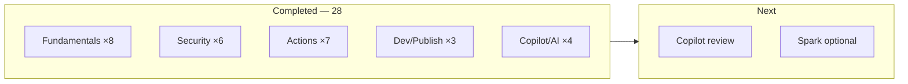

# GitHub Skills Learning Roadmap

> Personal study log for [**GitHub Foundations**](https://learn.microsoft.com/en-us/credentials/certifications/github-foundations/) prep.  
> **Logged practices:** 28 · **Last public update:** Deploy to Azure added

This file is a **study checklist**, not profile marketing copy. The public story lives in [README.md](README.md).

---

## Progress overview



| Track | Logged | Notes |
|:------|:------:|:------|
| Fundamentals | 8 | — |
| Security | 6 | — |
| Automation | 7 | — |
| Dev & Publishing | 3 | — |
| Copilot & AI | 4 | +1 excluded (`agentic-workflows…`) |

---

## How to run any practice

| Step | Action |
|:----:|:-------|
| 1 | Go to [skills.github.com](https://skills.github.com/) or the `@skills` repo linked below |
| 2 | Click **Use this template** → **Create a new repository** |
| 3 | Prefer **Public** for Skills exercises (keeps Actions minutes simple on individual accounts) |
| 4 | Open **Issues** — Mona posts Step 1 within ~20 seconds |
| 5 | Follow each issue/comment; open PRs when asked |
| 6 | Close the final issue → exercise complete |
| 7 | Update [README.md](README.md) — new row + count bump · then archive the exercise repo |

If a skill asks for Codespaces and quota is tight, use a **local clone** + your editor instead.

---

## Phase A — Collaboration & Git depth *(complete)*

| Practice | Status |
|:---------|:-------|
| [Connect the dots](https://github.com/skills/connect-the-dots) | Done — [`skills-connect-the-dots`](https://github.com/blackhebrewisraeli/skills-connect-the-dots) |
| [Release-based workflow](https://github.com/skills/release-based-workflow) | Done — [`skills-release-based-workflow`](https://github.com/blackhebrewisraeli/skills-release-based-workflow) |
| [Change commit history](https://github.com/skills/change-commit-history) | Done — [`skills-change-commit-history`](https://github.com/blackhebrewisraeli/skills-change-commit-history) |

---

## Phase B — Security track *(complete)*

| Practice | Status |
|:---------|:-------|
| [Configure CodeQL language matrix](https://github.com/skills/configure-codeql-language-matrix) | Done — [`skills-configure-codeql-language-matrix`](https://github.com/blackhebrewisraeli/skills-configure-codeql-language-matrix) |
| [Secure Code Game](https://github.com/skills/secure-code-game) | Done — [`skills-secure-code-game`](https://github.com/blackhebrewisraeli/skills-secure-code-game) |

---

## Phase C — Actions track *(complete)*

| Practice | Status |
|:---------|:-------|
| [Test with Actions](https://github.com/skills/test-with-actions) | Done — [`skills-test-with-actions`](https://github.com/blackhebrewisraeli/skills-test-with-actions) |
| [Publish Docker Images](https://github.com/skills/publish-docker-images) | Done — [`skills-publish-docker-images`](https://github.com/blackhebrewisraeli/skills-publish-docker-images) |
| [AI in Actions](https://github.com/skills/ai-in-actions) | Done — [`skills-ai-in-actions`](https://github.com/blackhebrewisraeli/skills-ai-in-actions) |

---

## Phase D — Copilot polish ← **NEXT**

| Practice | Status |
|:---------|:-------|
| [Getting started with GitHub Copilot](https://github.com/skills/getting-started-with-github-copilot) | Done — [`skills-getting-started-with-github-copilot`](https://github.com/blackhebrewisraeli/skills-getting-started-with-github-copilot) |
| [Copilot code review](https://github.com/skills/copilot-code-review) | **Next** · prefer local editor |
| [Customize your GitHub Copilot experience](https://github.com/skills/customize-your-github-copilot-experience) | Queued · local editor |

**Optional stretch**

- [Build applications with Copilot agent mode](https://github.com/skills/build-applications-w-copilot-agent-mode)
- [Your first extension for GitHub Copilot](https://github.com/skills/your-first-extension-for-github-copilot)

---

## Phase E — Optional / situational

| Practice | Notes |
|:---------|:------|
| [Deploy to Azure](https://github.com/skills/deploy-to-azure) | Done — [`skills-deploy-to-azure`](https://github.com/blackhebrewisraeli/skills-deploy-to-azure) |
| [Idea to App with Spark](https://github.com/skills/idea-to-app-with-spark) | If Spark is available on the account |
| [Copilot + Codespaces + VS Code](https://github.com/skills/copilot-codespaces-vscode) | After Codespaces quota is comfortable |
| [Migrate ADO repository](https://github.com/skills/migrate-ado-repository) | Skip unless you need ADO migration practice |

---

## Checklist

```
Phase A
[x] Connect the dots
[x] Release-based workflow
[x] Change commit history

Phase B
[x] Configure CodeQL language matrix
[x] Secure Code Game

Phase C
[x] Test with Actions
[x] Publish Docker Images
[x] AI in Actions

Phase D
[x] Getting started with GitHub Copilot
[ ] Copilot code review
[ ] Customize GitHub Copilot experience

Phase E
[x] Deploy to Azure
[ ] (optional) Idea to App with Spark
```

---

<sub>Completed work: [README.md](README.md) · Maintainer: <a href="https://github.com/blackhebrewisraeli">@blackhebrewisraeli</a></sub>
